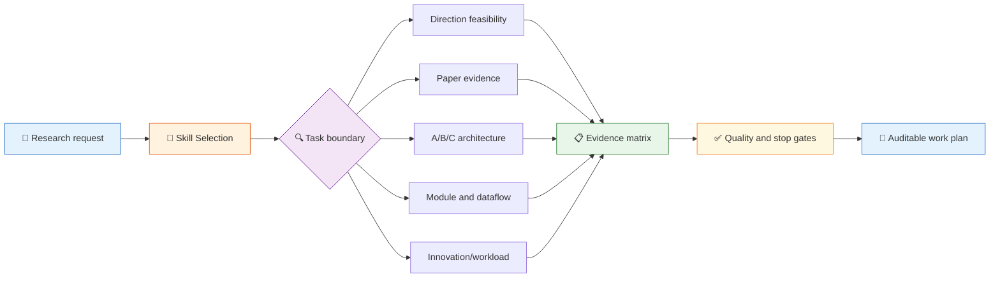

# academic-stitcher-skill

[](https://github.com/liang1228/academic-stitcher-skill)
[](https://github.com/liang1228/academic-stitcher-skill/tree/main/skills)
[](https://github.com/liang1228/academic-stitcher-skill/tree/main/skills)
[]()
[](README.md)
[](https://github.com/liang1228/academic-stitcher-skill/commits/main)

> [中文说明](README.md) | English README

**Structured academic research-planning skills for AI coding agents — turning research directions, paper evidence, module transfer, contribution review, and thesis delivery into an executable Skill Flow.**

The repository provides five independent entry points: direction feasibility, purpose-driven paper decomposition, variable-granularity A/B/C architecture, three-domain module and dataflow adaptation, and an innovation/workload dual-axis delivery review. Each entry keeps evidence state, boundaries, rollback conditions, and the next checkpoint explicit.



---

## Contents

- [✨ Core Features](#-core-features)
- [🚀 Quick Start](#-quick-start)
- [Design Goals](#design-goals)
- [Repository Layout](#repository-layout)
- [Skill Flow](#skill-flow)
- [Routes](#routes)
- [Typical Use Cases](#typical-use-cases)
- [Out Of Scope](#out-of-scope)
- [Prerequisites](#prerequisites)
- [Installation](#installation)
- [Validation](#validation)
- [Output Contract](#output-contract)
- [Design Principles](#design-principles)
- [Maintenance Rules](#maintenance-rules)
- [Contributing](#contributing)
- [License](#license)
- [Changelog](#changelog)

---

## ✨ Core Features

| Feature | Description |
|---------|-------------|
| 🧭 **Five entry routes** | Select the smallest skill for direction, papers, architecture, modules, or delivery |
| 📐 **Independent installation** | Every directory is a standalone Codex skill that can be copied and validated |
| 🔬 **Evidence-first** | Connect claims to materials, code, data, controls, ablations, and versions |
| 🧱 **Explicit boundaries** | Trigger conditions, neighboring skills, stop conditions, and non-goals stay visible |
| 🔁 **Composable flow** | Direction → paper evidence → A/B/C → module adaptation → delivery |
| 🌏 **Bilingual docs** | Chinese README and English README are maintained together |
| ✅ **Validated package** | Every entry has schema validation, trigger cases, decoys, and edge cases |

---

## 🚀 Quick Start

### Example 1: Assess whether a direction can run

**Your input:**

> I have a popular computer-vision direction, but nobody in my group can hand it over and the dataset is only verbally promised. Should I continue?

**Auto-routed to:** direction-feasibility-foundation-map

**Expected output:**

1. Activity, foundation, support, and resource hard gates;
2. Theory, experiment, data, equipment, and reproducibility gaps;
3. A time-boxed pilot with a deadline and continue/narrow/stop conditions.

### Example 2: Decompose papers by purpose

**Your input:**

> I have 40 papers and two weeks. Split them into must-read, optional, and defer for a reproduction goal, then extract baseline, modules, interfaces, and ablation evidence.

**Auto-routed to:** purpose-driven-paper-decomposition

**Expected output:**

- Evidence jobs for abstract, introduction, method, experiments, and code;
- Component inputs, outputs, dependencies, versions, and conflicts;
- A distinction between claims, controls, ablations, and pending checks.

### Example 3: Transfer a module after the baseline is stable

**Your input:**

> My baseline reproduces. A candidate module has matching shapes but requires an auxiliary label unavailable at deployment. Can it be called B-prime?

**Auto-routed to:** three-domain-module-search-dataflow-adaptation

**Expected output:**

- Candidate pools, mechanism, and the real input/output dataflow;
- Train/deploy contract differences;
- A single-module control, rollback conditions, cost, and B-prime ledger.

---

## Design Goals

- **Prove runnability first**: turn popularity, interest, and constraints into a feasibility card.
- **Read for a decision**: make reading depth serve reproduction, comparison, decomposition, or design.
- **Define A/B/C relative to the claim**: do not recount inherited components as new work after relabeling.
- **Adapt modules along the dataflow**: names, shapes, and a single score do not prove mechanism validity.
- **Separate innovation and delivery**: record new claims, experiments, engineering, chapters, and deliverables on separate axes.
- **Keep uncertainty visible**: missing evidence, current rules, and rights remain pending rather than becoming fabricated certainty.

## Repository Layout

```text
academic-stitcher-skill/
├── README.md                              # Chinese overview, badges, quick start, maintenance
├── README.en.md                           # English overview and installation
├── INDEX.md                               # Five entries, relationship map, recommended order
├── DIGEST.md                               # Reader-facing method digest
├── GLOSSARY.md                             # Shared terms and working definitions
│
└── skills/
    ├── direction-feasibility-foundation-map/
    │   ├── SKILL.md
    │   ├── agents/openai.yaml
    │   ├── test-prompts.json
    │   └── test-results.md
    ├── purpose-driven-paper-decomposition/
    │   ├── SKILL.md
    │   ├── agents/openai.yaml
    │   ├── test-prompts.json
    │   └── test-results.md
    ├── variable-granularity-abc-research-architecture/
    │   ├── SKILL.md
    │   ├── agents/openai.yaml
    │   ├── test-prompts.json
    │   └── test-results.md
    ├── three-domain-module-search-dataflow-adaptation/
    │   ├── SKILL.md
    │   ├── agents/openai.yaml
    │   ├── test-prompts.json
    │   └── test-results.md
    └── innovation-workload-dual-axis/
        ├── SKILL.md
        ├── agents/openai.yaml
        ├── test-prompts.json
        └── test-results.md
```

The root is not a single callable skill. It is a public collection of five independent entry points.

## Skill Flow

At runtime, the workflow is:

1. **Identify the task**: direction, papers, architecture, module transfer, or delivery.
2. **Select an entry**: read the matching SKILL.md and check neighboring routes.
3. **Freeze the boundary**: state the claim, comparison object, inputs/outputs, formal constraints, and missing data.
4. **Build the evidence matrix**: record facts, assumptions, rights, versions, changes, controls, ablations, and limitations.
5. **Run the smallest action**: prefer reversible, reproducible, reviewable tasks.
6. **Return checkpoints**: provide pass conditions, stop conditions, pending checks, and the next action.

## Routes

| Route | Purpose | Typical trigger |
| --- | --- | --- |
| direction-feasibility-foundation-map | Direction, foundation map, resource gates, minimum pilot | “Can this direction run?” |
| purpose-driven-paper-decomposition | Paper triage, four-entry reading, baseline/module/interface evidence | “Decompose these papers for reproduction” |
| variable-granularity-abc-research-architecture | Reuse across papers, A/B/C, inherited versus new work | “What did the second paper actually add?” |
| three-domain-module-search-dataflow-adaptation | Cross-domain module search, dataflow, B-prime/C-prime, train/deploy contract | “Can this module enter the baseline?” |
| innovation-workload-dual-axis | Innovation gap, workload gap, chapters and experiments | “Should I add a method or more experiments?” |

See [INDEX.md](INDEX.md) for the relationship map.

## Typical Use Cases

- Evaluate direction, foundations, resources, and deadline risk;
- Triage a large paper set by purpose and extract evidence;
- Resolve baseline reuse and contribution boundaries across papers;
- Search for modules across domains and validate the real dataflow;
- Separate innovation evidence, engineering workload, experiment coverage, and chapters;
- Prepare reviewable work packages for proposals, papers, milestones, or audits.

## Out Of Scope

This repository does not help with:

- fabricated data, citations, experiments, authorship, or review records;
- hidden reuse, plagiarism, detection evasion, or attribution concealment;
- intentionally weak baselines, removed negative results, or unfair comparisons;
- turning metric gains, paper counts, or experience thresholds into automatic contribution or policy;
- fabricating certainty when current formal rules, rights, or key experiments are missing.

## Prerequisites

| Requirement | Notes |
|-------------|-------|
| **AI Coding Agent** | Codex CLI, Codex Desktop, Claude Code, or another agent supporting Codex Skills |
| **skill-creator** | Optional; needed only for structural validation |
| **Python 3.8+** | Optional; useful for local batch validation |

No extra Python dependency is needed at runtime.

## Installation

### Recommended Codex prompt

Give Codex the following task:

```text
Install the independent Codex skills from:
https://github.com/liang1228/academic-stitcher-skill/tree/main/skills

Copy the selected skill directory, including SKILL.md, agents/openai.yaml,
test-prompts.json, and test-results.md, into the Codex skills directory.
```

### Windows PowerShell: install all five

```powershell
$repo = "C:/path/to/academic-stitcher-skill"
$dest = Join-Path $env:USERPROFILE ".codex\skills"
Get-ChildItem (Join-Path $repo "skills") -Directory | ForEach-Object {
    Copy-Item $_.FullName (Join-Path $dest $_.Name) -Recurse -Force
}
```

### macOS / Linux: install all five

```bash
for skill in skills/*; do
  [ -d "$skill" ] || continue
  cp -R "$skill" "$HOME/.codex/skills/$(basename "$skill")"
done
```

### Install one entry

Copy the entire skills/<skill-name>/ directory to:

```text
%USERPROFILE%\.codex\skills\<skill-name>
~/.codex/skills/<skill-name>
```

Do not copy only SKILL.md; keep agents/openai.yaml and the validation files with it.

## Validation

Use the validator bundled with skill-creator:

```powershell
$env:PYTHONUTF8 = "1"
$validator = "skill-creator/scripts/quick_validate.py"

Get-ChildItem .\skills -Directory | ForEach-Object {
    python $validator $_.FullName
}
```

Every entry should print:

```text
Skill is valid!
```

The published package also retains five test files with 30 routing cases:

- should_trigger: 15/15
- should_not_trigger: 10/10
- edge_case: 5/5

## Output Contract

A complete response should usually include:

| Output item | Description |
|-------------|-------------|
| **Intent & Route** | Current task, selected entry, and why neighboring routes were not selected |
| **State Ledger** | Facts, assumptions, gaps, pending items, and stop conditions |
| **Evidence Matrix** | Claims, materials, versions, code, data, controls, and ablations |
| **Work Packages** | Executable, reversible, reviewable experiment/engineering/chapter steps |
| **Risks & Boundaries** | Rights, reproducibility, attribution, cost, leakage, and formal-rule checks |
| **Next Checkpoint** | Next action, pass condition, deadline, and exit path |

For English manuscript work, return polished English first. If the input is Chinese notes, add concise Chinese structural notes.

## Design Principles

- **Evidence state beats narrative completeness**: mark pending instead of guessing.
- **Smallest executable action beats module stacking**: validate the baseline and contract first.
- **Neighboring entries have explicit roles**: do not let a broad route swallow a narrow task.
- **Historical attribution survives relabeling**: redrawing A/B/C does not reset contribution history.
- **Innovation and delivery are separate ledgers**: evidence may overlap, but counting must not.
- **Public and internal layers stay separate**: publish only installable, verifiable content.

## Maintenance Rules

- Keep each SKILL.md lean; maintain triggers, execution steps, and boundaries first.
- Update INDEX.md and GLOSSARY.md when relationships or shared terms change.
- After each change, run quick_validate.py, JSON parsing, link checks, and path/credential scans.
- Keep tests balanced across positive triggers, sibling-skill decoys, and edge cases.
- Do not commit local paths, credentials, caches, internal audits, or intermediate artifacts.
- Keep badges, contents, installation instructions, and validation counts synchronized between README files.

## Contributing

Contributions are welcome! Please follow this workflow:

1. Fork this repository.
2. Create a feature branch: git checkout -b feature/your-feature.
3. Run quick_validate.py for the affected skill.
4. Check Markdown links, JSON/YAML, and sensitive paths.
5. Submit a Pull Request describing motivation, scope, and validation evidence.

**Contribution priority:**

- 🔴 Trigger boundaries, evidence contracts, and validation fixes
- 🟡 New narrow research-planning entries or relationship-map improvements
- 🟢 README, glossary, examples, and installation documentation

## License

No LICENSE file is currently included at the repository root. Add an explicit license and rights statement before redistributing this package in another project.

## Changelog

| Version | Date | Description |
|---------|------|-------------|
| v3.0.0 | 2026-08-20 | Replaced the repository root with five independent academic research-planning skills and refreshed README, badges, installation, and validation docs |
| v2.x | Historical | Previous router-style academic-writing repository, superseded by the current root layout |

See [INDEX.md](INDEX.md), [DIGEST.md](DIGEST.md), and [GLOSSARY.md](GLOSSARY.md) for the relationship map and method documentation.
