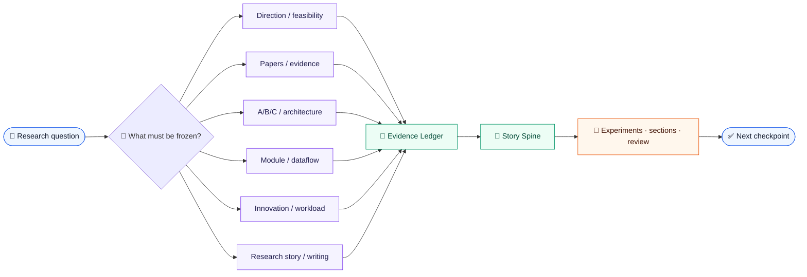

# academic-stitcher-skill

<div align="center">

<p>
  <a href="https://github.com/liang1228/academic-stitcher-skill"></a>
  <a href="https://github.com/liang1228/academic-stitcher-skill/tree/main/skills"></a>
  <a href="https://github.com/liang1228/academic-stitcher-skill/tree/main/skills"></a>
</p>
<p>
  <a href="https://github.com/liang1228/academic-stitcher-skill"></a>
  <a href="README.md"></a>
  <a href="https://github.com/liang1228/academic-stitcher-skill/commits/main"></a>
</p>

<h3>Turn research questions into auditable, reversible, deliverable workflows</h3>

<p>
  Structured academic research skills for AI coding agents:<br>
  an evidence-bound research-story, experiment-validation, and writing core connecting direction, paper evidence, module transfer, contribution review, and manuscript delivery.
</p>

<p>
  <a href="#-three-minute-start">🚀 Three-minute start</a> ·
  <a href="#routes">🧭 Choose an entry</a> ·
  <a href="INDEX.md">📚 Read the index</a> ·
  <a href="GLOSSARY.md">🧩 Browse the glossary</a>
</p>

</div>

> [!NOTE]
> This is not a prompt dump. It is a public skill collection built around routing, an evidence ledger, quality gates, and the next checkpoint. A story may organize evidence, but it cannot replace missing experiments, hide negative results, or invent attribution.

<table align="center">
  <tr>
    <td align="center" width="25%"><strong>1 + 5</strong><br><sub>one core base<br>five independent specialists</sub></td>
    <td align="center" width="25%"><strong>Story-first</strong><br><sub>pressure → mechanism → evidence<br>for a traceable paper spine</sub></td>
    <td align="center" width="25%"><strong>Evidence-bound</strong><br><sub>claims, materials, controls, ablations<br>and boundaries stay aligned</sub></td>
    <td align="center" width="25%"><strong>Rollback-ready</strong><br><sub>small actions, stop conditions<br>and checkpoints stay reviewable</sub></td>
  </tr>
</table>

## Contents

<details>
<summary><strong>Expand navigation</strong></summary>

- [✨ Core Features](#-core-features)
- [🚀 Three-minute Start](#-three-minute-start)
- [Research Story Spine](#research-story-spine)
- [Repository Layout](#repository-layout)
- [Skill Flow](#skill-flow)
- [Complete Process & Hard Boundaries](#complete-process--hard-boundaries)
- [Routes](#routes)
- [Scope & Boundaries](#scope--boundaries)
- [Installation](#installation)
- [Validation](#validation)
- [Output Contract](#output-contract)
- [Design & Maintenance Principles](#design--maintenance-principles)
- [Contributing](#contributing)
- [License](#license)
- [Changelog](#changelog)

</details>

## ✨ Core Features

| Capability | What you get |
|---|---|
| 🧭 **Core + five entries** | The core handles story, experiment validation, writing, review, and the full pipeline; five siblings handle narrow research-planning tasks |
| 🔬 **Evidence-first** | Claims are connected to materials, code, data, controls, ablations, versions, and rights |
| 🧱 **Explicit boundaries** | Triggers, neighboring skills, non-goals, stop conditions, and pending checks stay visible |
| 🔁 **Composable workflow** | Direction → paper evidence → A/B/C → module adaptation → story/sections → delivery |
| 📐 **Independent installation** | Every directory is a standalone Codex skill that can be copied, validated, and called on its own |
| ✅ **Reviewable delivery** | Schema checks, route fixtures, sibling-skill decoys, edge cases, and deterministic maintenance tests |

## 🚀 Three-minute Start

### 1. Choose by the question

| If you are asking… | Start here | First deliverable |
|---|---|---|
| Can this direction run? | <code>direction-feasibility-foundation-map</code> | Foundation, resource gates, and a minimum pilot |
| How should I read this paper set? | <code>purpose-driven-paper-decomposition</code> | Purpose-based evidence cards and a paper map |
| What did the second paper actually add? | <code>variable-granularity-abc-research-architecture</code> | A/B/C inherited–changed–new ledger |
| Can this module enter the baseline? | <code>three-domain-module-search-dataflow-adaptation</code> | Dataflow, train/deploy contracts, and a single-module control |
| Is the gap in novelty or workload? | <code>innovation-workload-dual-axis</code> | An innovation-axis × workload-axis strengthening plan |
| How do I turn several papers into one spine? | <code>academic-stitcher-skill</code> → <code>story-architecture</code> | Story Spine, Claim–Evidence–Boundary Map, and section order |
| How do I turn a claim into falsifiable experiments? | <code>academic-stitcher-skill</code> → <code>claim-driven-experiment</code> | Claim Ladder, experiment matrix, gates, and failure reflux |

### 2. Start with an explicit request

```text
I have three papers: A is the baseline, B is a module from a nearby domain,
and C is a data-processing change. First freeze each component's source,
actual change, and evidence state. Then decide whether the combination is
necessary and rebuild the Introduction, Method, Experiments, and Discussion.
Mark unsupported parts as missing/proposed; do not invent results.
```

### 3. Keep the complete entry directory

Do not copy only <code>SKILL.md</code>. The runtime entry, manifest, references, static assets, scripts, and validation files together form a reviewable skill.

<p align="center">
  <a href="INDEX.md"><strong>→ See the relationship map and recommended order</strong></a>
</p>

## Research Story Spine

The core does not “package” results for the user. It organizes existing evidence into an argument that can be questioned and falsified:

| Stage | Question to answer | Do not replace it with |
|---|---|---|
| <strong>01 · Pressure</strong> | Why does the current problem matter? | Hype, interest, or slogans |
| <strong>02 · Failure</strong> | Under what concrete condition does the inherited baseline fail? | A post-hoc weakness |
| <strong>03 · Gap</strong> | Why can existing methods not solve it directly? | An unsupported gap statement |
| <strong>04 · Design</strong> | Why this module, dataflow, or interface? | Name similarity or shape matching |
| <strong>05 · Mechanism</strong> | What mechanism produces a measurable prediction? | Treating a score gain as causality |
| <strong>06 · Evidence</strong> | Which control, ablation, or failure supports it? | Keeping only the prettiest result |
| <strong>07 · Boundary</strong> | When does the claim weaken or fail? | Stronger wording over pending evidence |

```text
problem pressure → inherited baseline → failure mode → unresolved gap → design principle
              → changed module → mechanism → measurable prediction → evidence → boundary
```

Once the spine is frozen, <code>claim-driven-experiment</code> connects each central claim to a main test, control, ablation, robustness/failure check, run order, and paper placement. It designs the evidence bridge; it does not pretend to have run experiments.

## Skill Flow



At runtime, the workflow is:

1. **Identify the task**: story, writing, review, direction, papers, architecture, modules, or delivery.
2. **Select an entry**: read the matching <code>SKILL.md</code> and check neighboring routes.
3. **Freeze the boundary**: state the claim, comparison object, inputs/outputs, formal constraints, and missing data.
4. **Build the evidence ledger**: record facts, assumptions, rights, versions, changes, controls, ablations, and limitations.
5. **Run the smallest action**: prefer reversible, reproducible, reviewable actions.
6. **Return a checkpoint**: provide pass conditions, stop conditions, pending checks, and the next action.

## Complete Process & Hard Boundaries

The core is not a generator that sees papers and immediately writes results. It is a stateful, stoppable workflow:

`S0 scope → S1 intake → S2 route-lock → S3 evidence-ledger → S4 integrity-gate → S5 architecture → S6 authorized-work → S7 independent-audit → S8 delivery-stop`

| Stage | Required artifact | If the gate does not pass |
|---|---|---|
| `S0–S2` | Scope, authorized checkpoint, input inventory, and one primary route | Do not enter manuscript prose or result claims; resolve scope, inputs, or route collision |
| `S3–S4` | Claim–evidence–provenance ledger plus fairness, rights, and attribution checks | Mark `missing`/`hold`/`blocked`; wording cannot repair the gap |
| `S5–S6` | Bounded claim, mechanism, prediction, and the authorized plan/draft/audit artifact | Deliver only the current checkpoint; do not report downstream work as complete |
| `S7–S8` | Independent audit, executed/not-executed record, and one observable next checkpoint | Preserve failure and uncertainty; reflux or stop |

Hard boundaries: a plan is not an experiment, a reported number is not a reproduction, a score difference is not mechanism proof, a story is not post-hoc motivation, and file validation is not model evaluation. When evidence is missing, return a bounded placeholder and the smallest evidence-producing task.

### Manuscript control layer

The core treats scientific writing as auditable control work, not sentence-only editing:

| Control | Delivery rule |
|---|---|
| **Alignment Checkpoint** | Freeze the central claim, reader question, terminology, paragraph map, and lead evidence before a long draft; stop at `confirm` when a high-leverage assumption is unresolved |
| **Terminology Ledger** | Lock canonical forms for methods, models, datasets, metrics, variables, and abbreviations; translation and polishing cannot drift silently |
| **Result Allocation** | Classify results as core, necessary support, qualification, robustness, heterogeneity, provenance detail, or boundary, then place them in main text, captions, Methods/source data, or SI |
| **Consistency Sweep** | Reconcile numbers and tables first, then claims versus data, units/terms/cross-references, and redundancy; mechanical findings require human inspection |
| **Review Freeze** | Use an immutable source packet, freeze lens reports before synthesis, and never call same-context work blind review |
| **Revision Readiness** | Keep `action`, `work_status`, `verification_evidence`, and `package_readiness` separate; no inspectable artifact means no `VERIFIED_DONE` |

These are generic evidence-bound controls, not official Nature or journal policy. Current journal, field, and institutional requirements take precedence.

## Routes

| Entry | Use it for | Typical trigger |
|---|---|---|
| <code>academic-stitcher-skill</code> | Hybrid-paper stories, claim-driven experiments, manuscript sections, structural polish, review, proposals, and the full pipeline | “Turn these modules into one research argument” |
| <code>direction-feasibility-foundation-map</code> | Direction, foundation map, resource gates, and a minimum pilot | “Can this direction run?” |
| <code>purpose-driven-paper-decomposition</code> | Paper triage, four-entry reading, and baseline/module/interface evidence | “Decompose these papers for reproduction” |
| <code>variable-granularity-abc-research-architecture</code> | Reuse across papers, A/B/C, and inherited versus new work | “What did the second paper actually add?” |
| <code>three-domain-module-search-dataflow-adaptation</code> | Cross-domain module search, dataflow, B-prime/C-prime, and train/deploy contracts | “Can this module enter the baseline?” |
| <code>innovation-workload-dual-axis</code> | Innovation gaps, workload gaps, chapters, and experiment delivery | “Should I add a method or more experiments?” |

See [INDEX.md](INDEX.md) for the relationship map, [DIGEST.md](DIGEST.md) for the method digest, and [GLOSSARY.md](GLOSSARY.md) for shared terms.

## Quick Examples

<details>
<summary><strong>Example 1 · Assess whether a direction can run</strong></summary>

> I have a popular computer-vision direction, but nobody in my group can hand it over and the dataset is only verbally promised. Should I continue?

**Auto-routed to:** <code>direction-feasibility-foundation-map</code>

**Expected output:** activity, foundation, support, resource gates, reproducibility gaps, a time-boxed pilot, and continue/narrow/stop conditions.

</details>

<details>
<summary><strong>Example 2 · Decompose papers by purpose</strong></summary>

> I have 40 papers and two weeks. Split them into must-read, optional, and defer for a reproduction goal, then extract baseline, modules, interfaces, and ablation evidence.

**Auto-routed to:** <code>purpose-driven-paper-decomposition</code>

**Expected output:** evidence jobs, component inputs and outputs, dependencies, versions, implementation conflicts, claims, controls, and pending checks.

</details>

<details>
<summary><strong>Example 3 · Validate a cross-domain module</strong></summary>

> My baseline reproduces. A candidate module has matching shapes but requires an auxiliary label unavailable at deployment. Can it be called B-prime?

**Auto-routed to:** <code>three-domain-module-search-dataflow-adaptation</code>

**Expected output:** candidate pools, real dataflow, train/deploy contracts, a single-module control, rollback conditions, cost, and a B-prime ledger.

</details>

<details>
<summary><strong>Example 4 · Turn a hybrid design into a research story</strong></summary>

> I have three papers: A is the baseline, B is a module from a nearby domain, and C is a data-processing change. Explain why the combination is necessary, then rebuild the argument order for the Introduction, Method, Experiments, and Discussion without inventing results.

**Auto-routed to:** <code>academic-stitcher-skill</code> → <code>story-architecture</code>

**Expected output:** a Story Spine, Claim–Evidence–Boundary Map, module attribution, falsifiable tests, section/figure/experiment order, and a reviewer stress test.

</details>

<details>
<summary><strong>Example 5 · Turn the central claim into an experiment loop</strong></summary>

> The central claim and baseline are frozen. List the main test, strongest control, decisive ablation, robustness checks, run order, and stop/go gates; do not write any unobserved result.

**Auto-routed to:** <code>academic-stitcher-skill</code> → <code>claim-driven-experiment</code>

**Expected output:** a Claim Ladder, Claim–Evidence–Experiment Matrix, sanity → baseline → main → decision → polish order, failure interpretations, and main-paper/appendix placement.

</details>

## Repository Layout

```text
academic-stitcher-skill/
├── README.md / README.en.md       # bilingual entry, badges, quick start, installation
├── INDEX.md / DIGEST.md           # relationship map, recommended order, method digest
├── GLOSSARY.md                    # shared terms and working definitions
└── skills/
    ├── academic-stitcher-skill/   # story, writing, review, and full-pipeline core
    │   ├── SKILL.md
    │   ├── manifest.yaml
    │   ├── static/                # core, route, paper type, section, language
    │   ├── references/            # planning, writing, evaluation playbooks
    │   ├── scripts/               # local validation and maintenance scripts
    │   └── tests/                 # 52 core route/boundary fixtures
    └── five specialist entries/   # direction, papers, A/B/C, modules, innovation/workload
```

The root is not a single callable skill. It is a public collection of one core base and five independent sibling entries.

## Scope & Boundaries

### Typical use cases

- Evaluate direction, foundations, resources, and deadline risk;
- Triage a large paper set by purpose and extract evidence;
- Resolve baseline reuse and contribution boundaries across papers;
- Search for modules across domains and validate the real dataflow;
- Separate innovation evidence, engineering workload, experiment coverage, and chapters;
- Turn multi-paper or multi-module combinations into a bounded research story with a central claim, mechanism chain, and evidence boundary, then translate that claim into falsifiable experiments.

### Explicit non-goals

- fabricated data, citations, experiments, authorship, or review records;
- hidden reuse, plagiarism, detection evasion, or attribution concealment;
- intentionally weak baselines, removed negative results, or unfair comparisons;
- turning metric gains, paper counts, or experience thresholds into automatic contribution or policy;
- fabricating certainty when current formal rules, rights, or key experiments are missing.

## Prerequisites

| Requirement | Notes |
|---|---|
| **AI Coding Agent** | Codex CLI, Codex Desktop, Claude Code, or another agent supporting Codex Skills |
| **skill-creator** | Optional; needed only for structural validation |
| **Python 3.8+** | Optional; useful for local batch validation |

No extra Python dependency is needed at runtime.

## Installation

### Recommended Codex prompt

```text
Install the independent Codex skills from:
https://github.com/liang1228/academic-stitcher-skill/tree/main/skills

Copy the selected skill directory intact, including SKILL.md, agents/openai.yaml,
and its bundled manifest, references, static assets, scripts, and validation files,
into the Codex skills directory.
```

### Windows PowerShell: install all six

```powershell
$repo = "C:/path/to/academic-stitcher-skill"
$dest = Join-Path $env:USERPROFILE ".codex\skills"
Get-ChildItem (Join-Path $repo "skills") -Directory | ForEach-Object {
    Copy-Item $_.FullName (Join-Path $dest $_.Name) -Recurse -Force
}
```

### macOS / Linux: install all six

```bash
for skill in skills/*; do
  [ -d "$skill" ] || continue
  cp -R "$skill" "$HOME/.codex/skills/$(basename "$skill")"
done
```

### Install one entry

Copy the entire <code>skills/&lt;skill-name&gt;/</code> directory to:

```text
%USERPROFILE%\.codex\skills\<skill-name>
~/.codex/skills/<skill-name>
```

Do not copy only <code>SKILL.md</code>; keep <code>agents/openai.yaml</code>, validation files, and the entry bundled assets with it.

## Validation

Use the validator bundled with skill-creator:

```powershell
$env:PYTHONUTF8 = "1"
$validator = "skill-creator/scripts/quick_validate.py"

Get-ChildItem .\skills -Directory | ForEach-Object {
    python $validator $_.FullName
}
```

Every entry should print:

```text
Skill is valid!
```

The current candidate package contains 30 routing cases for the five sibling skills plus 56 route/boundary fixtures for the core base:

| Test layer | Result |
|---|---:|
| should_trigger | 15 / 15 |
| should_not_trigger | 10 / 10 |
| edge_case | 5 / 5 |
| Core deterministic maintenance tests | **12 / 12** |

The new <code>story-architecture</code> and <code>claim-driven-experiment</code> prompts are fixture coverage; they are not mixed with independent model blind-test results.

## Output Contract

| Output item | Description |
|---|---|
| **Intent & Route** | Current task, selected entry, and why neighboring routes were not selected |
| **State Ledger** | Facts, assumptions, gaps, pending items, and stop conditions |
| **Evidence Matrix** | Claims, materials, versions, code, data, controls, and ablations |
| **Story Spine** | Pressure, failure mode, gap, mechanism, prediction, evidence, and boundary |
| **Claim–Evidence–Experiment Matrix** | Central claims, primary tests, controls, ablations, failure checks, run gates, and paper placement |
| **Work Packages** | Executable, reversible, reviewable experiment/engineering/chapter steps |
| **Risks & Boundaries** | Rights, reproducibility, attribution, cost, leakage, and formal-rule checks |
| **Next Checkpoint** | Next action, pass condition, deadline, and exit path |

For English manuscript work, return polished English first. If the input is Chinese notes, add concise Chinese structural notes.

## Design & Maintenance Principles

- **Evidence state beats narrative completeness**: mark pending instead of guessing.
- **Every research story must be traceable**: keep unsupported transitions as missing/proposed instead of strengthening the prose.
- **Every experiment must serve a claim**: state what belief the run can change, how it can fail, and how the story will be revised if it fails.
- **Smallest executable action beats module stacking**: validate the baseline and contract first.
- **Neighboring entries have explicit roles**: do not let a broad route swallow a narrow task.
- **Historical attribution survives relabeling**: redrawing A/B/C does not reset contribution history.
- **Innovation and delivery are separate ledgers**: evidence may overlap, but counting must not.
- **Public and internal layers stay separate**: publish only installable, verifiable content.

After changing the README or a skill, check:

1. Badge, contents, installation, and validation numbers in both languages;
2. Markdown relative links, JSON/YAML, and code fences;
3. Local paths, credentials, caches, internal audits, and intermediate artifacts;
4. Positive triggers, sibling-skill decoys, and edge cases.

## Contributing

Contributions are welcome! Please follow this workflow:

1. Fork this repository;
2. Create a feature branch: <code>git checkout -b feature/your-feature</code>;
3. Run quick_validate.py for the affected skill;
4. Check Markdown links, JSON/YAML, and sensitive paths;
5. Submit a Pull Request describing motivation, scope, and validation evidence.

**Contribution priority:** 🔴 trigger boundaries / evidence contracts / validation fixes　🟡 new narrow entries / relationship map　🟢 README / glossary / examples / installation

## License

No LICENSE file is currently included at the repository root. Add an explicit license and rights statement before redistributing this package in another project.

## Changelog

| Version | Date | Description |
|---|---|---|
| Unreleased | 2026-08-21 | Distilled the manuscript control layer: Alignment Checkpoint, terminology ledger, result placement, consistency audit, review freeze, and revision readiness; core raised to 2.6.0 with 56 fixtures |
| v3.3.0 | 2026-08-21 | Added the S0–S8 process contract, Process Status, explicit boundaries, and 52 core fixtures |
| v3.2.0 | 2026-08-21 | Added the claim-driven-experiment route, experiment matrix, decision gates, failure reflux, and 48 core fixtures |
| v3.1.0 | 2026-08-21 | Restored the public core base, added the story-architecture route, hybrid-paper story fixtures, and core maintenance validation |
| v3.0.0 | 2026-08-20 | Replaced the root with five independent academic research-planning skills and refreshed README, badges, installation, and validation docs |
| v2.x | Historical | Previous router-style academic-writing repository, superseded by the current root layout |

<p align="center">
  <a href="INDEX.md">INDEX</a> ·
  <a href="DIGEST.md">DIGEST</a> ·
  <a href="GLOSSARY.md">GLOSSARY</a> ·
  <a href="README.md">中文 README</a>
</p>
