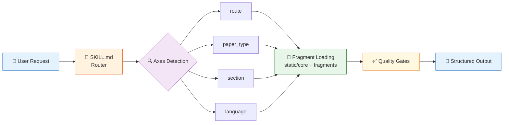

# academic-stitcher-skill

[](https://github.com/liang1228/academic-stitcher-skill)
[](LICENSE)
[]()
[]()

> English README | [中文说明](README.md)

**A structured Codex/Claude Code skill for academic paper planning, manuscript drafting, Nature-style polishing, reviewer-facing self-audit, and Ctx2Skill-style skill maintenance.**

It turns papers, baselines, modules, thesis constraints, draft sections, and experiment results into a defensible problem-mechanism-evidence narrative.



The repository follows the router-style design of [Yuan1z0825/nature-skills](https://github.com/Yuan1z0825/nature-skills): a lean `SKILL.md`, a declarative `manifest.yaml`, always-loaded `static/core` files, task-specific `static/fragments`, and deeper `references` loaded only when needed. It also preserves the local distilled knowledge from paper-stitching and graduate-research planning materials.

---

## Table Of Contents

- [Key Features](#key-features)
- [Quick Start](#quick-start)
- [Design Goals](#design-goals)
- [Repository Layout](#repository-layout)
- [Skill Flow](#skill-flow)
- [Routes](#routes)
- [Ctx2Skill Self-Audit](#ctx2skill-self-audit)
- [Typical Use Cases](#typical-use-cases)
- [Out Of Scope](#out-of-scope)
- [Prerequisites](#prerequisites)
- [Installation](#installation)
- [Validation](#validation)
- [Output Contract](#output-contract)
- [Design Lineage](#design-lineage)
- [Maintenance Rules](#maintenance-rules)
- [Contributing](#contributing)
- [License](#license)
- [Changelog](#changelog)

---

## Key Features

| Feature | Description |
|---------|-------------|
| 🧭 **Smart Routing** | Auto-detects 4 axes (route / paper_type / section / language) and loads the minimal necessary context |
| 📐 **Progressive Disclosure** | `SKILL.md` is just a router; `static/core` is always loaded; `static/fragments` are task-specific; `references/` are on-demand |
| 🔬 **Evidence-First** | Every claim must map to data, citation, experiment, figure, or explicit limitation — no unsupported claims |
| 🛡️ **Compliant Synthesis** | Treats phrases like "paper stitching" as vocabulary, then converts them into transparent, attributable, reproducible research planning |
| 🌏 **Bilingual** | Supports Chinese research notes / thesis proposals and English manuscript prose |
| 🔄 **Self-Eval Loop** | `ctx2skill-audit` route maintains the skill with challenger tasks, rubrics, failure diagnosis, and replay gates |

---

## Quick Start

### Example 1: Stitch a Paper Direction

**Your input:**

> "I have 3 papers on address parsing, a BERT-CRF baseline, and a SoftLexicon module. Help me stitch a small paper direction."

**Auto-routed to:** `stitch-plan` → `research` → `zh-cn`

**Output structure:**

```markdown
## Story Spine
1. Field pressure: Chinese address NER has fuzzy boundaries in open-domain scenarios
2. Failure mode: BERT-CRF has low recall on nested/rare entity boundaries
3. Proposed move: SoftLexicon provides lexical priors → enhance BERT character representations
4. Mechanism: lexicon-aware residual adapter injects domain knowledge
5. Evidence: CCKS 2021 dev F1 0.920 → +0.3pp over baseline
6. Boundary: verified only on Chinese address scenarios, no general NER SOTA claim

## Claim-Evidence Map
| Claim | Evidence | Status | Boundary |
| --- | --- | --- | --- |
| SoftLexicon improves boundary recall | per-type delta: SubPOI +15 TP | verified | CCKS 2021 only |
```

### Example 2: Section Drafting

**Your input:**

> "Help me write the Experiments section. Datasets: CCKS 2021 and NAACL 2019. Main model: BERT-CRF + boundary-aware pretraining."

**Auto-routed to:** `section-draft` → `experiments` → `en`

### Example 3: Reviewer Audit

**Your input:**

> "Review the Method and Experiments of this paper from a reviewer's perspective. Find hard issues."

**Auto-routed to:** `reviewer-audit` → `research` → `method` + `experiments`

---

## Design Goals

- **Structured skill flow**: route paper planning, section drafting, Nature-style polishing, reviewer audit, and full-pipeline work explicitly.
- **Progressive disclosure**: keep `SKILL.md` compact and load only the fragments relevant to the current request.
- **Evidence-first writing**: every major claim must map to data, citation, experiment, figure, or explicit limitation.
- **Compliant synthesis**: treat phrases such as "paper stitching" as user vocabulary, then convert them into transparent, attributable, reproducible research planning.
- **Bilingual usability**: support Chinese research notes, Chinese thesis/proposal contexts, and English manuscript prose.
- **Self-evaluation loop**: add a `ctx2skill-audit` route for maintaining the skill with challenger tasks, rubrics, failure diagnosis, and replay gates.

## Repository Layout

```text
academic-stitcher-skill/
├── SKILL.md                          # Router entry point (lean — trigger + route only)
├── manifest.yaml                     # Declarative routing config (axes, fragments, reference triggers)
├── README.md
├── README.en.md
├── DEVLOG-v2.2.md                    # v2.2 distillation update log
│
├── agents/
│   └── openai.yaml                   # OpenAI Codex agent config
│
├── scripts/                          # Ctx2Skill self-evaluation maintenance scripts
│   ├── build_ctx2skill_input.py      # Generate JSONL input from current skill files
│   ├── run_ctx2skill_selfplay.py     # Orchestrate self-play execution
│   └── summarize_ctx2skill_run.py    # Summarize failed rubrics and replay leads
│
├── static/
│   ├── core/                         # Always-loaded core rules
│   │   ├── stance.md                 #   Compliance stance & ethical boundaries
│   │   ├── workflow.md               #   General workflow
│   │   ├── quality-gates.md          #   Quality gate checks
│   │   └── output-format.md          #   Default output format
│   │
│   └── fragments/                    # On-demand scene-specific fragments
│       ├── route/                    # 6 route fragments
│       │   ├── stitch-plan.md        #   Paper direction / A+B design / proposal
│       │   ├── section-draft.md      #   Section writing
│       │   ├── nature-polish.md      #   Nature-style polishing
│       │   ├── reviewer-audit.md     #   Reviewer-perspective audit
│       │   ├── full-pipeline.md      #   End-to-end pipeline
│       │   └── ctx2skill-audit.md    #   Ctx2Skill self-evaluation
│       │
│       ├── paper_type/               # 5 paper types
│       │   ├── research.md           #   Research paper
│       │   ├── methods.md            #   Methods paper
│       │   ├── algorithmic.md        #   Algorithmic paper
│       │   ├── review.md             #   Survey / review
│       │   └── proposal-thesis.md    #   Proposal / graduate thesis
│       │
│       ├── section/                  # 8 section fragments
│       │   ├── title.md
│       │   ├── abstract.md
│       │   ├── introduction.md
│       │   ├── related-work.md
│       │   ├── method.md
│       │   ├── experiments.md
│       │   ├── discussion.md
│       │   └── conclusion.md
│       │
│       └── language/                 # 2 languages
│           ├── zh-cn.md              #   Chinese
│           └── en.md                 #   English
│
└── references/                       # Deep reference materials (on-demand)
    ├── playbook.md                   # Paper matrix, grey vocabulary, graduate workflows
    ├── writing-suite.md              # Codex-suite writing routes, reviewer panels
    ├── transcript-derived-playbook.md # Academic experience distilled from Bilibili transcripts
    └── ctx2skill-evaluation.md       # Ctx2Skill evaluation methodology
```

## Skill Flow

The skill works as a router:

1. Read `manifest.yaml`.
2. Load the `always_load` core files.
3. Detect the request axes: `route`, `paper_type`, `section`, and `language`.
4. Load only the matching fragments under `static/fragments`.
5. Read `references/` only when deeper templates, source-informed rules, or video-distilled heuristics are needed.
6. Run quality gates for evidence, attribution, fair comparison, flow, reviewer pressure, and packaging.

## Routes

| Route | Purpose | Typical Trigger |
| --- | --- | --- |
| `stitch-plan` | Research idea, A+B module design, thesis topic, proposal, advisor plan, experiment roadmap | "stitch a direction", "can this A+B get published" |
| `section-draft` | Title, abstract, introduction, related work, method, experiments, discussion, conclusion | "write the Introduction", "organize experiment results" |
| `nature-polish` | Structural polishing, Nature-style English, Chinese-to-English manuscript prose, overclaim control | "polish to Nature style", "translate Chinese to English" |
| `reviewer-audit` | Methodology, domain, skeptical-reviewer, and integrity checks | "find hard issues from a reviewer's perspective", "pre-submission check" |
| `full-pipeline` | Intake, paper matrix, story architecture, evidence gate, drafting, audit, revision roadmap | "do the full process end to end" |
| `ctx2skill-audit` | Ctx2Skill-style challenger tasks, rubrics, failure taxonomy, and replay gates for maintaining this skill | "check this skill with Ctx2Skill" |

## Ctx2Skill Self-Audit

When the user asks to optimize or evaluate this skill with Ctx2Skill, route to `ctx2skill-audit`:

1. Build a context pack from `SKILL.md`, `manifest.yaml`, core rules, and relevant fragments.
2. Generate 3-5 challenger tasks that require this skill's context rather than generic academic-writing ability.
3. Give each task 8-15 binary rubric checks covering routing, evidence boundaries, compliance, output contract, and progressive disclosure.
4. Classify failures as content gap, structure gap, constraint violation, reasoning error, task misunderstanding, or system-prompt non-compliance.
5. Make the smallest bounded file update and apply a replay gate to confirm the change helps hard tasks without bloating easy tasks.

If the actual Ctx2Skill framework, model API, judge, and replay selection were not run, label the result as a deterministic local audit rather than a completed self-play run.

The repository includes a three-step maintenance toolchain:

| Script | Purpose |
|--------|---------|
| `scripts/build_ctx2skill_input.py` | Generate Ctx2Skill JSONL input from current skill files |
| `scripts/run_ctx2skill_selfplay.py` | Orchestrate input generation, self-play execution, log capture, and summary generation |
| `scripts/summarize_ctx2skill_run.py` | Summarize self-play JSONL results into failed rubrics, proposed skills, and replay leads |

Generated JSONL inputs, self-play outputs, logs, summaries, and temporary reasoner/challenger skills are local evaluation artifacts and should not be committed to the published skill package.

`scripts/run_ctx2skill_selfplay.py` reads a shared model name from `OPENAI_MODEL`, or accepts `--model` plus per-role overrides such as `--challenger-model`, `--reasoner-model`, `--judge-model`, `--proposer-model`, and `--generator-model`; on Windows it resolves `ctx2skill-selfplay.cmd` before launching the framework.

## Typical Use Cases

- Turn several related papers into a realistic small-paper or SCI story.
- Decide whether a baseline plus one module forms a defensible contribution.
- Build an opening-report research plan with feasible work packages.
- Convert experiment tables and notes into Introduction, Method, or Experiments sections.
- Polish Chinese notes into bounded English manuscript prose.
- Stress-test a manuscript from a reviewer perspective.
- Translate advisor constraints into a concrete research roadmap.
- Evaluate the skill's own routes, quality gates, and maintenance gaps with Ctx2Skill-style tasks.

## Out Of Scope

This skill does not help with:

- fabricated data, citations, experiments, authorship, or peer-review history;
- plagiarism, rewriting to evade detection, or hidden reuse;
- intentionally weak baselines or unfair comparison;
- false random sampling claims for curated examples;
- hiding failed experiments, negative evidence, or data provenance;
- packaging unsupported speculation as top-venue novelty.

## Prerequisites

| Requirement | Notes |
|-------------|-------|
| **AI Coding Agent** | [Codex CLI](https://github.com/openai/codex) or [Claude Code](https://docs.anthropic.com/en/docs/claude-code) or any agent that supports Codex Skills |
| **Python 3.8+** | Only needed for Ctx2Skill self-evaluation scripts (optional) |
| **skill-creator** | Only needed for validation step (optional) |

> 💡 If you only use the 6 core routing features, no Python or extra dependencies are required.

## Installation

### Recommended Codex Prompt

```text
Install the Codex skill from:
https://github.com/liang1228/academic-stitcher-skill.git
Preserve the full folder structure, including manifest.yaml, static/, references/, and agents/.
```

### Claude Code

```text
Install the Claude Code skill from:
https://github.com/liang1228/academic-stitcher-skill.git
```

Or manually copy to:

```text
~/.claude/skills/academic-stitcher-skill
```

### Manual Installation

Copy the entire repository folder into your skills directory:

```bash
# Codex
~/.codex/skills/academic-stitcher-skill

# Claude Code
~/.claude/skills/academic-stitcher-skill

# Windows (Codex)
%USERPROFILE%\.codex\skills\academic-stitcher-skill

# Windows (Claude Code)
%USERPROFILE%\.claude\skills\academic-stitcher-skill
```

> ⚠️ **Do not copy only `SKILL.md`.** The router depends on the full directory structure: `manifest.yaml`, `static/`, `references/`, and `agents/openai.yaml`.

## Validation

Use the validator bundled with `skill-creator`:

```powershell
$env:PYTHONUTF8='1'
python <skill-creator>\scripts\quick_validate.py <academic-stitcher-skill>
```

Expected result:

```text
Skill is valid!
```

## Output Contract

A complete response should usually include:

| Output Item | Description |
|-------------|-------------|
| **Route & Paper Type** | Auto-detected route and paper type |
| **Story Spine** | Field pressure → Failure mode → Proposed move → Mechanism → Evidence → Boundary |
| **Claim-Evidence Map** | Each claim mapped to evidence, status, and boundary |
| **Work Packages** | Section / experiment / revision concrete steps |
| **Evidence Gaps** | Missing evidence and content that needs to be filled |
| **Compliance Risks** | Integrity risks and compliance boundaries |
| **Reviewer Objections** | Predicted reviewer challenges |
| **Next Checkpoint** | Next action and verification point |

For English manuscript work, return polished English first. If the source material is Chinese, add concise Chinese notes explaining structural decisions.

## Design Lineage

- [Yuan1z0825/nature-skills](https://github.com/Yuan1z0825/nature-skills): router-style layout, manifest axes, static fragments, and quality gates.
- [Master-cai/Research-Paper-Writing-Skills](https://github.com/Master-cai/Research-Paper-Writing-Skills): section-level writing, paragraph flow, and claim-evidence alignment.
- [Imbad0202/academic-research-skills-codex](https://github.com/Imbad0202/academic-research-skills-codex): Codex suite orchestration, inline role passes, and reviewer independence.
- [wanshuiyin/Auto-claude-code-research-in-sleep](https://github.com/wanshuiyin/Auto-claude-code-research-in-sleep): 5-layer audit chain, Dual-Axis Control, cross-model adversarial review.
- [alchaincyf/nuwa-skill](https://github.com/alchaincyf/nuwa-skill): triple-verification distillation methodology, contradiction handling, quality self-check.
- Local project distillation: paper positioning, inheritance chains, module stitching, compliance translation of grey vocabulary, and graduate-research scenarios.

## Maintenance Rules

- Put common runtime rules in `static/core`.
- Put route, paper-type, section, and language variants in `static/fragments`.
- Put deeper templates and source-informed summaries in `references`.
- Keep raw transcripts, per-video notes, fetch tables, upstream examples, tests, and scripts out of the main skill unless an evidence package is explicitly requested.
- Keep `SKILL.md` lean and router-focused.
- Keep skill self-evaluation rules in the `ctx2skill-audit` fragment and `references/ctx2skill-evaluation.md`; do not commit temporary audit logs to the installable package.
- After major edits, run `quick_validate.py` and scan for local paths, credentials, and intermediate artifacts.

## Contributing

Contributions are welcome! Please follow this workflow:

1. **Fork** this repository.
2. Create a feature branch: `git checkout -b feature/your-feature`.
3. Run validation after changes: `python quick_validate.py <skill-dir>`.
4. Scan for path/credential leaks: ensure no local paths, API keys, or intermediate artifacts.
5. Submit a **Pull Request** with a description of the motivation and scope.

**Contribution priority:**

- 🔴 Bug fixes / quality gate corrections
- 🟡 New route fragments / paper types / section types
- 🟢 Documentation improvements / example additions

## License

[MIT License](LICENSE)

## Changelog

| Version | Date | Description |
|---------|------|-------------|
| v2.2 | 2026-06-30 | Major distillation update: enriched all fragments from 524 Bilibili transcripts + 3 external skills |
| v2.1.10 | — | Initial release: router + manifest.yaml + progressive loading architecture |

Detailed changelog: [DEVLOG-v2.2.md](DEVLOG-v2.2.md).
