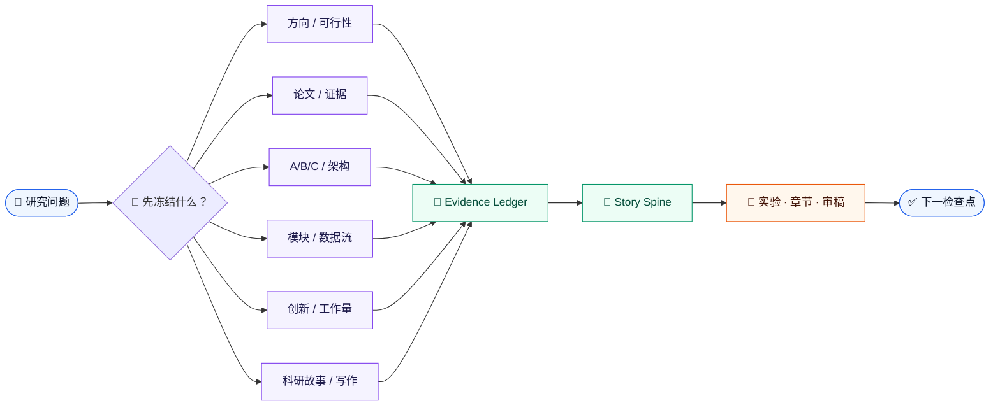

# academic-stitcher-skill

<div align="center">

<p>
  <a href="https://github.com/liang1228/academic-stitcher-skill"></a>
  <a href="https://github.com/liang1228/academic-stitcher-skill/tree/main/skills"></a>
  <a href="https://github.com/liang1228/academic-stitcher-skill/tree/main/skills"></a>
</p>
<p>
  <a href="https://github.com/liang1228/academic-stitcher-skill"></a>
  <a href="README.en.md"></a>
  <a href="https://github.com/liang1228/academic-stitcher-skill/commits/main"></a>
</p>

<h3>把科研问题变成可核查、可回滚、可交付的研究工作流</h3>

<p>
  面向 AI Coding Agent 的结构化学术研究 Skills：<br>
  用证据约束的研究故事、实验验证与写作基座，串起方向、论文证据、模块迁移、创新判断和论文交付。
</p>

<p>
  <a href="#-三分钟开始">🚀 三分钟开始</a> ·
  <a href="#routes">🧭 选择入口</a> ·
  <a href="INDEX.md">📚 阅读索引</a> ·
  <a href="GLOSSARY.md">🧩 查术语</a>
</p>

</div>

> [!NOTE]
> 这不是提示词合集，而是一套“路由 + 证据账本 + 质量门 + 下一检查点”的公开 skill 集合。故事可以组织证据，但不能替代缺失实验、隐藏负结果或补造归属。

<table align="center">
  <tr>
    <td align="center" width="25%"><strong>1 + 5</strong><br><sub>一个核心基座<br>五个独立窄域入口</sub></td>
    <td align="center" width="25%"><strong>Story-first</strong><br><sub>问题压力 → 机制 → 证据<br>让论文主线可回溯</sub></td>
    <td align="center" width="25%"><strong>Evidence-bound</strong><br><sub>主张、材料、对照、消融<br>和边界逐项对齐</sub></td>
    <td align="center" width="25%"><strong>Rollback-ready</strong><br><sub>最小动作、停止条件<br>和下一步都可验收</sub></td>
  </tr>
</table>

## Contents

<details>
<summary><strong>展开目录</strong></summary>

- [✨ 核心特性](#-核心特性)
- [🚀 三分钟开始](#-三分钟开始)
- [研究故事主线](#研究故事主线)
- [仓库结构](#仓库结构)
- [Skill Flow](#skill-flow)
- [Routes](#routes)
- [适用与边界](#适用与边界)
- [安装方式](#安装方式)
- [验证](#验证)
- [输出标准](#输出标准)
- [设计与维护原则](#设计与维护原则)
- [Contributing](#contributing)
- [License / 许可](#license--许可)
- [Changelog](#changelog)

</details>

## ✨ 核心特性

| 能力 | 你会得到什么 |
|------|--------------|
| 🧭 **核心 + 五入口** | 核心基座负责故事、实验验证、写作、审稿和全流程；五个兄弟入口负责研究规划窄域 |
| 🔬 **证据优先** | 把主张连接到材料、代码、数据、对照、消融、版本和权利条件 |
| 🧱 **边界清晰** | 公开写清触发条件、相邻 skill、不可用场景、停止条件和待核验项 |
| 🔁 **可组合工作流** | 方向 → 论文证据 → A/B/C → 模块适配 → 故事/章节 → 交付 |
| 📐 **独立安装** | 每个目录都是可以单独复制、验证和调用的 Codex skill |
| ✅ **可验证交付** | 结构校验、路由 fixture、兄弟 skill 诱饵、边界测试和确定性维护测试 |

## 🚀 三分钟开始

### 1. 先按问题选择入口

| 如果你正在问…… | 从这里开始 | 第一份交付 |
|---|---|---|
| 这个方向能不能做？ | <code>direction-feasibility-foundation-map</code> | 基础、资源硬门和最小试点 |
| 这批论文该怎么读？ | <code>purpose-driven-paper-decomposition</code> | 按目的筛选的证据卡和论文地图 |
| 第二篇到底新增了什么？ | <code>variable-granularity-abc-research-architecture</code> | A/B/C 继承—改动—新增账本 |
| 这个模块能不能接进基线？ | <code>three-domain-module-search-dataflow-adaptation</code> | 数据流、训练/部署契约和单模块对照 |
| 方法不够新还是实验不够？ | <code>innovation-workload-dual-axis</code> | 创新轴 × 工作量轴的补强计划 |
| 多篇论文怎样讲成一条主线？ | <code>academic-stitcher-skill</code> → <code>story-architecture</code> | Story Spine、主张—证据—边界图和章节顺序 |
| 主张怎样落成可证伪实验？ | <code>academic-stitcher-skill</code> → <code>claim-driven-experiment</code> | Claim Ladder、实验矩阵、运行门和失败回炉 |

### 2. 用一个明确的请求启动

```text
我有三篇论文：A 是基线，B 是相邻领域模块，C 是数据处理改动。
请先冻结每个组件的来源、实际改动和证据状态，再判断组合是否必要；
最后重建 Introduction、Method、Experiments、Discussion 的顺序。
没有证据的地方标记 missing/proposed，不要编结果。
```

### 3. 保留完整入口目录

不要只复制 <code>SKILL.md</code>。运行时入口、manifest、references、static、scripts 和验证文件共同构成一个可复核 skill。

<p align="center">
  <a href="INDEX.md"><strong>→ 查看入口关系图与推荐顺序</strong></a>
</p>

## 研究故事主线

核心基座不是替用户“包装结果”，而是把已有证据组织成一条可追问、可证伪的论证链：

| 阶段 | 要回答的问题 | 不能偷换成 |
|---|---|---|
| <strong>01 · 压力</strong> | 当前任务为什么值得解决？ | 热点、兴趣或口号 |
| <strong>02 · 失效</strong> | 继承基线在哪个具体条件下失效？ | 事后编出的缺点 |
| <strong>03 · 缺口</strong> | 现有方法为什么无法直接解决？ | 没有证据的 gap |
| <strong>04 · 设计</strong> | 为什么选择这个模块、数据流或接口？ | 只因名字相似或形状匹配 |
| <strong>05 · 机制</strong> | 改动通过什么机制产生可测预测？ | 把分数提升当因果解释 |
| <strong>06 · 证据</strong> | 哪个对照、消融或失败结果支持它？ | 只保留最漂亮的结果 |
| <strong>07 · 边界</strong> | 哪些条件下结论会变弱或失效？ | 用更强措辞掩盖 pending |

```text
问题压力 → 继承基线 → 失败模式 → 未解缺口 → 设计原则
     → 变更模块 → 机制 → 可测预测 → 证据 → 边界
```

当故事主线冻结后，<code>claim-driven-experiment</code> 把每个中心主张连接到主实验、对照、消融、鲁棒性/失败检查、运行顺序和论文落点；它只设计证据闭环，不冒充已经运行实验。

## Skill Flow



运行时遵循六步：

1. **识别任务**：判断是故事、写作、审稿，还是方向、论文、架构、模块和交付。
2. **选择入口**：读取匹配目录的 <code>SKILL.md</code>，检查相邻 skill 是否更合适。
3. **冻结边界**：写清主张、比较对象、输入输出、制度约束和缺失信息。
4. **建立证据账本**：记录事实、假设、权利、版本、改动、对照、消融和限制。
5. **执行最小动作**：优先选择可回滚、可复现、可验收的动作。
6. **返回检查点**：给出通过条件、停止条件、pending 项和下一动作。

## Routes

| 入口 | 适合什么 | 典型触发 |
|---|---|---|
| <code>academic-stitcher-skill</code> | 杂交论文故事、主张驱动实验、章节写作、结构润色、审稿、开题与全流程 | “把这些模块讲成一条科研主线” |
| <code>direction-feasibility-foundation-map</code> | 研究方向、基础地图、资源硬门、最小试点 | “这个方向能不能做” |
| <code>purpose-driven-paper-decomposition</code> | 论文筛选、四入口阅读、基线/模块/接口证据 | “按复现目标拆这批论文” |
| <code>variable-granularity-abc-research-architecture</code> | 连续论文复用、A/B/C、继承与新增边界 | “第二篇到底新增了什么” |
| <code>three-domain-module-search-dataflow-adaptation</code> | 跨域模块搜索、数据流、B′/C′、训练部署契约 | “这个模块能不能接进基线” |
| <code>innovation-workload-dual-axis</code> | 创新不足、工作量不足、章节和实验交付 | “该补方法还是补实验” |

详细关系图见 [INDEX.md](INDEX.md)；方法精华见 [DIGEST.md](DIGEST.md)；共享术语见 [GLOSSARY.md](GLOSSARY.md)。

## Quick Examples

<details>
<summary><strong>Example 1 · 判断方向是否值得继续</strong></summary>

> 我有一个很热门的视觉研究方向，但组内没人做，数据只有口头承诺；请按基础、资源和最小复现判断要不要继续。

**自动路由：** <code>direction-feasibility-foundation-map</code>

**输出重点：** 文献活跃度、知识地图、支持条件、资源硬门、最小试点、截止时间和继续/缩题/换题条件。

</details>

<details>
<summary><strong>Example 2 · 按复现目的拆解论文</strong></summary>

> 我有 40 篇论文和两周时间，请按复现目标分成必读、选读和暂不读，并抽取基线、模块、接口与消融证据。

**自动路由：** <code>purpose-driven-paper-decomposition</code>

**输出重点：** 取证任务、组件输入输出、依赖版本、实现冲突、作者主张、对照和 pending 检查。

</details>

<details>
<summary><strong>Example 3 · 验证跨域模块能否接入</strong></summary>

> 我的基线已经能复现，候选模块形状匹配但部署时没有辅助标注，能不能直接算 B′？

**自动路由：** <code>three-domain-module-search-dataflow-adaptation</code>

**输出重点：** 三域候选池、真实数据流、训练/部署契约、单模块对照、回滚条件和 B′ 改动台账。

</details>

<details>
<summary><strong>Example 4 · 把杂交方案讲成一条科研故事</strong></summary>

> 我有三篇论文：A 是基线，B 是相邻领域模块，C 是数据处理改动。请先解释为什么必须组合，再重建 Introduction、Method、Experiments、Discussion 的论证顺序，不要编结果。

**自动路由：** <code>academic-stitcher-skill</code> → <code>story-architecture</code>

**输出重点：** Story Spine、Claim–Evidence–Boundary Map、模块归属、可证伪实验、章节/图表/实验顺序和审稿人压力测试。

</details>

<details>
<summary><strong>Example 5 · 把中心主张变成实验闭环</strong></summary>

> 中心主张和基线已经冻结，请列出主实验、最强对照、关键消融、鲁棒性检查、运行顺序和 stop/go 门；不要写任何尚未观测的结果。

**自动路由：** <code>academic-stitcher-skill</code> → <code>claim-driven-experiment</code>

**输出重点：** Claim Ladder、Claim–Evidence–Experiment Matrix、sanity → baseline → main → decision → polish、失败解释和主文/附录落点。

</details>

## 仓库结构

```text
academic-stitcher-skill/
├── README.md / README.en.md       # 双语入口、徽标、快速上手和安装
├── INDEX.md / DIGEST.md           # 关系图、推荐顺序和方法精华
├── GLOSSARY.md                    # 共享术语与工作性定义
└── skills/
    ├── academic-stitcher-skill/   # 故事、写作、审稿和全流程核心基座
    │   ├── SKILL.md
    │   ├── manifest.yaml
    │   ├── static/                # core、route、paper type、section、language
    │   ├── references/            # planning、writing、evaluation playbooks
    │   ├── scripts/               # 本地验证和维护脚本
    │   └── tests/                 # 48 条基座路由/边界 fixture
    └── five specialist entries/   # 方向、论文、A/B/C、模块、创新/工作量
```

根目录不是一个需要单独调用的 skill，而是一个核心基座和五个独立兄弟入口的公开集合。

## 适用与边界

### 适用场景

- 选研究方向并评估基础、资源和期限风险；
- 从大量论文中按目的筛选和拆解证据；
- 处理连续论文中的基线复用与贡献边界；
- 跨域寻找模块并核对真实输入—输出数据流；
- 区分创新证据、工程工作量、实验覆盖和章节交付；
- 把多篇论文/多模块组合成有中心论点、机制链和证据边界的科研故事；再把主张落成可证伪实验闭环。

### 明确不做

- 伪造数据、引用、实验结果、作者贡献或评审记录；
- 隐藏重复使用、洗稿、规避检测或掩盖归属；
- 故意挑弱基线、删除负结果或制造不公平比较；
- 把指标提升、论文数量或经验阈值直接写成创新或制度结论；
- 在缺少当前正式规则、权利或关键实验时补造确定答案。

## 前置要求

| 要求 | 说明 |
|---|---|
| **AI Coding Agent** | Codex CLI、Codex Desktop、Claude Code 或其他支持 Codex Skills 的 Agent |
| **skill-creator** | 仅运行结构校验时需要，可选 |
| **Python 3.8+** | 仅本地批量验证测试文件时需要，可选 |

只使用运行时 skill 时，不需要额外 Python 依赖。

## 安装方式

### Codex 推荐提示

```text
Install the independent Codex skills from:
https://github.com/liang1228/academic-stitcher-skill/tree/main/skills

Copy the selected skill directory intact, including SKILL.md, agents/openai.yaml,
and its bundled manifest, references, static assets, scripts, and validation files,
into the Codex skills directory.
```

### Windows PowerShell：安装全部六个

```powershell
$repo = "C:/path/to/academic-stitcher-skill"
$dest = Join-Path $env:USERPROFILE ".codex\skills"
Get-ChildItem (Join-Path $repo "skills") -Directory | ForEach-Object {
    Copy-Item $_.FullName (Join-Path $dest $_.Name) -Recurse -Force
}
```

### macOS / Linux：安装全部六个

```bash
for skill in skills/*; do
  [ -d "$skill" ] || continue
  cp -R "$skill" "$HOME/.codex/skills/$(basename "$skill")"
done
```

### 只安装一个入口

将 <code>skills/&lt;skill-name&gt;/</code> 整个目录复制到：

```text
%USERPROFILE%\.codex\skills\<skill-name>
~/.codex/skills/<skill-name>
```

不要只复制 <code>SKILL.md</code>；<code>agents/openai.yaml</code>、运行验证文件及该入口的 bundled assets 应与它一起保留。

## 验证

使用 skill-creator 的校验脚本：

```powershell
$env:PYTHONUTF8 = "1"
$validator = "skill-creator/scripts/quick_validate.py"

Get-ChildItem .\skills -Directory | ForEach-Object {
    python $validator $_.FullName
}
```

每个入口都应显示：

```text
Skill is valid!
```

当前发布包包含 5 个兄弟 skill 的 30 条路由案例，以及核心基座的 48 条路由/边界 fixture：

| 测试层 | 结果 |
|---|---:|
| should_trigger | 15 / 15 |
| should_not_trigger | 10 / 10 |
| edge_case | 5 / 5 |
| 核心确定性维护测试 | **9 / 9** |

新增的 <code>story-architecture</code> 与 <code>claim-driven-experiment</code> 题目属于 fixture 覆盖，不与独立模型盲测结果混计。

## 输出标准

| 输出项 | 说明 |
|---|---|
| **Intent & Route** | 当前任务、选用入口和不选相邻入口的理由 |
| **State Ledger** | 事实、假设、缺口、pending 和停止条件 |
| **Evidence Matrix** | 主张、材料、版本、代码、数据、对照和消融 |
| **Story Spine** | 问题压力、失效模式、缺口、机制、预测、证据和边界 |
| **Claim–Evidence–Experiment Matrix** | 中心主张、主实验、对照、消融、失败检查、运行门和论文落点 |
| **Work Packages** | 可执行、可回滚、可验收的实验/工程/章节步骤 |
| **Risks & Boundaries** | 权利、复现、归属、成本、泄漏和制度核验风险 |
| **Next Checkpoint** | 下一动作、通过条件、截止时间和退出路径 |

英文稿件优先输出 polished English；输入为中文笔记时，再附简短中文结构说明。

## 设计与维护原则

- **证据状态优先于叙事完整度**：不确定就标记 pending。
- **科研故事必须可回溯**：没有证据的转场保留 missing/proposed，不用更强措辞填补。
- **实验必须服务于主张**：每个运行块都要说明它改变哪个判断、如何失败以及失败后如何回炉。
- **最小可执行动作优先于模块堆叠**：先验证基线和契约。
- **相邻入口显式分工**：不让一个宽泛入口吞掉窄域任务。
- **历史归属不随标签变化**：A/B/C 重画不等于贡献重置。
- **创新与交付分轴记录**：两种证据可以交叉，但不能重复计数。
- **公开包与内部材料分层**：发布结构只保留可安装、可验证内容。

维护 README 或 skill 后，请同步检查：

1. 中英文徽标、目录、安装方式和验证数字；
2. Markdown 相对链接、JSON/YAML 和代码围栏；
3. 本机路径、凭据、缓存、内部审计和中间产物；
4. 正向触发、兄弟 skill 诱饵和边界情景。

## Contributing

欢迎贡献！请遵循以下流程：

1. Fork 本仓库；
2. 创建 feature 分支：<code>git checkout -b feature/your-feature</code>；
3. 修改后运行对应 skill 的 quick_validate.py；
4. 检查 Markdown 链接、JSON/YAML 和敏感路径；
5. 提交 Pull Request，说明修改动机、影响范围和验证结果。

**贡献优先级：** 🔴 触发边界/证据契约/验证修复　🟡 新窄域入口/关系图　🟢 README/术语/示例/安装文档

## License / 许可

当前仓库根目录未附带 LICENSE 文件。若要在其他项目中再分发，请先补充明确的许可证和权利声明。

## Changelog

| 版本 | 日期 | 说明 |
|---|---|---|
| Unreleased | 2026-08-21 | 新增 claim-driven-experiment 主张—实验闭环，并继续完善双语 README 层级 |
| v3.2.0 | 2026-08-21 | 新增 claim-driven-experiment 路由、实验矩阵、运行决策门、失败回炉和 48 条核心 fixture |
| v3.1.0 | 2026-08-21 | 恢复公开核心基座，新增 story-architecture 路由、杂交论文故事 fixture 和核心维护验证 |
| v3.0.0 | 2026-08-20 | 根目录替换为五个独立学术研究规划 skill，补齐公开 README、徽标、安装和验证说明 |
| v2.x | 历史版本 | 旧版路由式学术写作仓库，已由当前根目录结构替代 |

<p align="center">
  <a href="INDEX.md">INDEX</a> ·
  <a href="DIGEST.md">DIGEST</a> ·
  <a href="GLOSSARY.md">GLOSSARY</a> ·
  <a href="README.en.md">English README</a>
</p>
