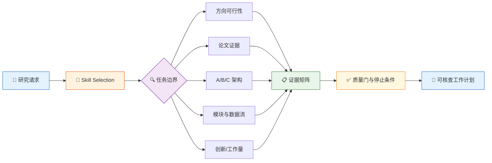

# academic-stitcher-skill

[](https://github.com/liang1228/academic-stitcher-skill)
[](https://github.com/liang1228/academic-stitcher-skill/tree/main/skills)
[](https://github.com/liang1228/academic-stitcher-skill/tree/main/skills)
[]()
[](README.en.md)
[](https://github.com/liang1228/academic-stitcher-skill/commits/main)

> 中文说明 | [English README](README.en.md)

**面向 AI Coding Agent 的结构化学术研究规划 Skills —— 把研究方向、论文证据、模块迁移、创新判断和论文交付组织成一条可执行的 Skill Flow。**

五个独立入口分别处理方向可行性、目的驱动的论文拆解、可变粒度 A/B/C 架构、三域模块与数据流适配，以及创新—工作量双轴交付。每个入口都强调证据状态、边界条件、可回滚步骤和下一检查点。



---

## 目录

- [✨ 核心特性](#-核心特性)
- [🚀 快速上手](#-快速上手)
- [设计目标](#设计目标)
- [仓库结构](#仓库结构)
- [Skill Flow](#skill-flow)
- [Routes](#routes)
- [适用场景](#适用场景)
- [不适用场景](#不适用场景)
- [前置要求](#前置要求)
- [安装方式](#安装方式)
- [验证](#验证)
- [输出标准](#输出标准)
- [设计原则](#设计原则)
- [维护原则](#维护原则)
- [Contributing](#contributing)
- [License / 许可](#license--许可)
- [Changelog](#changelog)

---

## ✨ 核心特性

| 特性 | 说明 |
|------|------|
| 🧭 **五入口路由** | 按方向、论文、架构、模块和交付任务选择最小必要 skill |
| 📐 **独立安装** | 每个目录都是可单独复制、验证和调用的 Codex skill |
| 🔬 **证据优先** | 要求把主张连接到材料、代码、数据、对照、消融和版本 |
| 🧱 **边界清晰** | 明确触发条件、相邻 skill、不可用场景和停止条件 |
| 🔁 **可组合工作流** | 方向 → 论文证据 → A/B/C → 模块适配 → 双轴交付 |
| 🌏 **中英双语** | 中文 README 与 English README 同步维护 |
| ✅ **可验证交付** | 每个 skill 都有结构校验、触发测试、诱饵测试和边界测试 |

---

## 🚀 快速上手

### 示例 1：判断研究方向能不能做

**你的输入：**

> 我有一个很热门的视觉研究方向，但组内没人做，数据只有口头承诺；请按基础、资源和最小复现判断要不要继续。

**自动路由：** direction-feasibility-foundation-map

**输出重点：**

1. 文献活跃度、知识地图、支持条件和资源硬门；
2. 理论、实验、数据、设备和复现能力缺口；
3. 最小试点任务、截止时间和继续/缩题/换题条件。

### 示例 2：按目的拆解论文

**你的输入：**

> 我有 40 篇论文和两周时间，请按复现目标分成必读、选读和暂不读，并抽取基线、模块、接口与消融证据。

**自动路由：** purpose-driven-paper-decomposition

**输出重点：**

- 摘要、引言、方法、实验和代码各自承担什么取证任务；
- 组件输入、输出、依赖、版本和实现冲突；
- 哪些是作者主张，哪些有对照或消融支持。

### 示例 3：已有基线后迁移模块

**你的输入：**

> 我的基线已经能复现，想从相似领域找模块；候选形状匹配但部署时没有辅助标注，能不能直接算 B′？

**自动路由：** three-domain-module-search-dataflow-adaptation

**输出重点：**

- 三域候选池、机制问题和真实数据流；
- 训练契约与部署契约差异；
- 单模块对照、回滚条件、成本和 B′ 改动台账。

---

## 设计目标

- **先判断能不能做**：把热点、兴趣和资源约束拆成可核验的方向卡。
- **按决定读取论文**：让阅读深度服从复现、比较、拆解或设计任务。
- **按当前主张定义 A/B/C**：不把继承组件改名后重复计作新贡献。
- **沿数据流适配模块**：不以名称相似、形状匹配或单一分数替代机制验证。
- **分开创新和工作量**：把新主张、实验、工程、章节和交付证据分别记账。
- **保留不确定性**：缺失证据、当前规则和权利条件都标为 pending，而不是补造结论。

## 仓库结构

```text
academic-stitcher-skill/
├── README.md                              # 中文入口、徽标、快速上手和维护说明
├── README.en.md                           # English overview and installation
├── INDEX.md                               # 五个入口、关系图和推荐顺序
├── DIGEST.md                               # 面向读者的方法精华
├── GLOSSARY.md                             # 共享术语与工作性定义
│
└── skills/
    ├── direction-feasibility-foundation-map/
    │   ├── SKILL.md
    │   ├── agents/openai.yaml
    │   ├── test-prompts.json
    │   └── test-results.md
    ├── purpose-driven-paper-decomposition/
    │   ├── SKILL.md
    │   ├── agents/openai.yaml
    │   ├── test-prompts.json
    │   └── test-results.md
    ├── variable-granularity-abc-research-architecture/
    │   ├── SKILL.md
    │   ├── agents/openai.yaml
    │   ├── test-prompts.json
    │   └── test-results.md
    ├── three-domain-module-search-dataflow-adaptation/
    │   ├── SKILL.md
    │   ├── agents/openai.yaml
    │   ├── test-prompts.json
    │   └── test-results.md
    └── innovation-workload-dual-axis/
        ├── SKILL.md
        ├── agents/openai.yaml
        ├── test-prompts.json
        └── test-results.md
```

根目录不是一个需要单独调用的 skill，而是五个独立入口的公开集合。

## Skill Flow

运行时按以下顺序工作：

1. **识别任务**：判断用户是在选方向、读论文、冻结架构、迁移模块还是规划交付。
2. **选择入口**：读取对应目录的 SKILL.md，并检查相邻 skill 是否更合适。
3. **冻结边界**：写清当前主张、比较对象、输入输出、制度约束和缺失信息。
4. **建立证据矩阵**：记录事实、假设、权利、版本、改动、对照、消融和限制。
5. **执行最小动作**：优先使用可回滚、可复现、可验收的最小任务。
6. **输出检查点**：给出通过条件、停止条件、待核验项和下一步。

## Routes

| Route | 用途 | 典型触发 |
| --- | --- | --- |
| direction-feasibility-foundation-map | 研究方向、基础地图、资源硬门、最小试点 | “这个方向能不能做” |
| purpose-driven-paper-decomposition | 论文筛选、四入口阅读、基线/模块/接口证据 | “按复现目标拆这批论文” |
| variable-granularity-abc-research-architecture | 连续论文复用、A/B/C、继承与新增边界 | “第二篇到底新增了什么” |
| three-domain-module-search-dataflow-adaptation | 跨域模块搜索、数据流、B′/C′、训练部署契约 | “这个模块能不能接进基线” |
| innovation-workload-dual-axis | 创新不足、工作量不足、章节和实验交付 | “该补方法还是补实验” |

详细关系图见 [INDEX.md](INDEX.md)。

## 适用场景

- 选研究方向并评估基础、资源和期限风险；
- 从大量论文中按目的筛选和拆解证据；
- 处理连续论文中的基线复用与贡献边界；
- 跨域寻找模块并核对真实输入—输出数据流；
- 区分创新证据、工程工作量、实验覆盖和章节交付；
- 为开题、论文、阶段检查或审稿准备可核查工作包。

## 不适用场景

本仓库不提供以下帮助：

- 伪造数据、引用、实验结果、作者贡献或评审记录；
- 隐藏重复使用、洗稿、规避检测或掩盖归属；
- 故意挑弱基线、删除负结果或制造公平比较；
- 把指标提升、论文数量或经验阈值直接写成创新或制度结论；
- 在缺少当前正式规则、权利或关键实验时补造确定答案。

## 前置要求

| 要求 | 说明 |
|------|------|
| **AI Coding Agent** | Codex CLI、Codex Desktop、Claude Code 或其他支持 Codex Skills 的 Agent |
| **skill-creator** | 仅运行结构校验时需要，可选 |
| **Python 3.8+** | 仅本地批量验证测试文件时需要，可选 |

只使用运行时 skill 时，不需要额外 Python 依赖。

## 安装方式

### Codex 推荐提示

把下面的任务交给 Codex：

```text
Install the independent Codex skills from:
https://github.com/liang1228/academic-stitcher-skill/tree/main/skills

Copy the selected skill directory, including SKILL.md, agents/openai.yaml,
test-prompts.json, and test-results.md, into the Codex skills directory.
```

### Windows PowerShell：安装全部五个

```powershell
$repo = "C:/path/to/academic-stitcher-skill"
$dest = Join-Path $env:USERPROFILE ".codex\skills"
Get-ChildItem (Join-Path $repo "skills") -Directory | ForEach-Object {
    Copy-Item $_.FullName (Join-Path $dest $_.Name) -Recurse -Force
}
```

### macOS / Linux：安装全部五个

```bash
for skill in skills/*; do
  [ -d "$skill" ] || continue
  cp -R "$skill" "$HOME/.codex/skills/$(basename "$skill")"
done
```

### 只安装一个入口

将 skills/<skill-name>/ 整个目录复制到：

```text
%USERPROFILE%\.codex\skills\<skill-name>
~/.codex/skills/<skill-name>
```

不要只复制 SKILL.md；agents/openai.yaml 和运行验证文件应与它一起保留。

## 验证

使用 skill-creator 的校验脚本：

```powershell
$env:PYTHONUTF8 = "1"
$validator = "skill-creator/scripts/quick_validate.py"

Get-ChildItem .\skills -Directory | ForEach-Object {
    python $validator $_.FullName
}
```

每个入口都应显示：

```text
Skill is valid!
```

当前发布包还保留 5 个测试文件，共 30 条路由案例：

- should_trigger：15/15
- should_not_trigger：10/10
- edge_case：5/5

## 输出标准

默认输出应包含：

| 输出项 | 说明 |
|--------|------|
| **Intent & Route** | 当前任务、选用入口和不选相邻入口的理由 |
| **State Ledger** | 事实、假设、缺口、pending 和停止条件 |
| **Evidence Matrix** | 主张、材料、版本、代码、数据、对照和消融 |
| **Work Packages** | 可执行、可回滚、可验收的实验/工程/章节步骤 |
| **Risks & Boundaries** | 权利、复现、归属、成本、泄漏和制度核验风险 |
| **Next Checkpoint** | 下一动作、通过条件、截止时间和退出路径 |

英文稿件优先输出 polished English；输入为中文笔记时，再附简短中文结构说明。

## 设计原则

- **证据状态优先于叙事完整度**：不确定就标记 pending。
- **最小可执行动作优先于模块堆叠**：先验证基线和契约。
- **相邻入口显式分工**：不让一个宽泛入口吞掉窄域任务。
- **历史归属不随标签变化**：A/B/C 重画不等于贡献重置。
- **创新与交付分轴记录**：两种证据可以交叉，但不能重复计数。
- **公开包与内部材料分层**：发布结构只保留可安装、可验证内容。

## 维护原则

- 保持每个 SKILL.md 精炼，重点维护触发条件、执行步骤和边界。
- 共享术语和关系变化同步更新 INDEX.md 与 GLOSSARY.md。
- 每次修改后运行 quick_validate.py、JSON 解析、链接检查和路径/凭据扫描。
- 测试题必须覆盖正向触发、兄弟 skill 诱饵和边界情景。
- 不把本机路径、凭据、缓存、内部审计和中间产物提交到公开根目录。
- README 与 README.en.md 的徽标、目录、安装方式和验证数字保持同步。

## Contributing

欢迎贡献！请遵循以下流程：

1. Fork 本仓库。
2. 创建 feature 分支：git checkout -b feature/your-feature。
3. 修改后运行对应 skill 的 quick_validate.py。
4. 检查 Markdown 链接、JSON/YAML 和敏感路径。
5. 提交 Pull Request，说明修改动机、影响范围和验证结果。

**贡献优先级：**

- 🔴 触发边界、证据契约和验证错误修复
- 🟡 新的窄域研究规划入口或关系图改进
- 🟢 README、术语、示例和安装文档改进

## License / 许可

当前仓库根目录未附带 LICENSE 文件。若要在其他项目中再分发，请先补充明确的许可证和权利声明。

## Changelog

| 版本 | 日期 | 说明 |
|------|------|------|
| v3.0.0 | 2026-08-20 | 根目录替换为五个独立学术研究规划 skills，补齐公开 README、徽标、安装和验证说明 |
| v2.x | 历史版本 | 旧版路由式学术写作仓库，已由当前根目录结构替代 |

详细关系与方法说明见 [INDEX.md](INDEX.md)、[DIGEST.md](DIGEST.md) 和 [GLOSSARY.md](GLOSSARY.md)。
