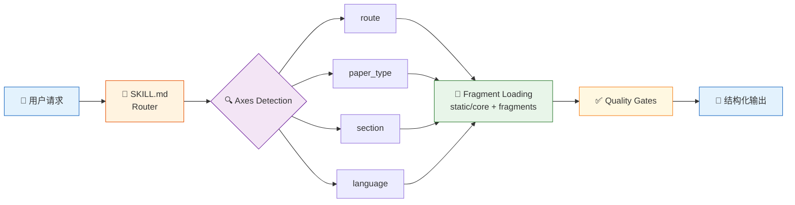

# academic-stitcher-skill

[](https://github.com/liang1228/academic-stitcher-skill)
[](LICENSE)
[]()
[]()

> 中文说明 | [English README](README.en.md)

**面向 AI Coding Agent 的结构化学术写作 Skill —— 把论文构思、章节写作、润色、审稿和全流程管线统一成一条可执行的路由式 Skill flow。**

它把"缝论文 / 论文故事 / A+B 组合 / 研究生开题 / SCI 写作 / Nature-style polishing / 预审稿 / Ctx2Skill 自评估"统一成一条可执行的 Skill flow：先识别目标与证据，再构建问题-机制-证据链，最后输出章节、实验、审稿风险和下一步工作包。



该仓库参考了 [Yuan1z0825/nature-skills](https://github.com/Yuan1z0825/nature-skills) 的 router-style 结构，吸收了其 `manifest.yaml`、`static/core`、`static/fragments`、按需加载和质量门思路；同时保留本项目从 B 站"缝论文 / 论文故事"材料中蒸馏出的研究规划、论文包装、灰色话术合规转译与研究生场景经验。

---

## 目录

- [✨ 核心特性](#-核心特性)
- [🚀 快速上手](#-快速上手)
- [设计目标](#设计目标)
- [仓库结构](#仓库结构)
- [Skill Flow](#skill-flow)
- [Routes](#routes)
- [Ctx2Skill 自评估](#ctx2skill-自评估)
- [适用场景](#适用场景)
- [不适用场景](#不适用场景)
- [前置要求](#前置要求)
- [安装方式](#安装方式)
- [验证](#验证)
- [输出标准](#输出标准)
- [设计来源](#设计来源)
- [维护原则](#维护原则)
- [Contributing](#contributing)
- [License](#license)
- [Changelog](#changelog)

---

## ✨ 核心特性

| 特性 | 说明 |
|------|------|
| 🧭 **智能路由** | 自动检测 4 个轴（route / paper_type / section / language），按需加载最小必要上下文 |
| 📐 **渐进式加载** | `SKILL.md` 只做路由；`static/core` 常驻；`static/fragments` 按场景选载；`references/` 按需深入 |
| 🔬 **证据优先** | 每个 claim 必须绑定数据、引用、实验、图表或显式 limitation，拒绝无据声称 |
| 🛡️ **合规转译** | 保留"缝论文""水文"等用户语言作为触发词，执行层只给透明、可引用、可复现、可辩护的方案 |
| 🌏 **中英双语** | 同时支持中文研究笔记 / 开题 / 毕业场景和英文 manuscript prose |
| 🔄 **自评估可迭代** | `ctx2skill-audit` route 用 Ctx2Skill 式 challenger / judge / failure diagnosis / replay 维护 skill 本身 |

---

## 🚀 快速上手

### 示例 1：缝论文方向

**你的输入：**

> "我有 3 篇关于地址解析的论文，还有一个 BERT-CRF baseline 和一个 SoftLexicon 模块，帮我缝一个能写的小论文方向。"

**自动路由：** `stitch-plan` → `research` → `zh-cn`

**输出结构：**

```markdown
## Story Spine
1. 领域压力：中文地址要素解析在开放场景下边界模糊
2. 失败模式：BERT-CRF 对嵌套/稀有实体边界召回低
3. 方案：SoftLexicon 提供词汇先验 → 增强 BERT 字符表示
4. 机制：lexicon-aware residual adapter 注入领域知识
5. 证据：CCKS 2021 dev F1 0.920 → +0.3pp over baseline
6. 边界：仅验证中文地址场景，不声称通用 NER SOTA

## Claim-Evidence Map
| Claim | Evidence | Status | Boundary |
| --- | --- | --- | --- |
| SoftLexicon 增强边界召回 | per-type delta: SubPOI +15 TP | verified | 仅 CCKS 2021 |
```

### 示例 2：章节写作

**你的输入：**

> "帮我写 Experiments section，数据集是 CCKS 2021 和 NAACL 2019，主模型 BERT-CRF + boundary-aware pretraining。"

**自动路由：** `section-draft` → `experiments` → `en`

### 示例 3：审稿预审

**你的输入：**

> "从审稿人视角审一下这篇论文的 Method 和 Experiments，找硬伤。"

**自动路由：** `reviewer-audit` → `research` → `method` + `experiments`

---

## 设计目标

- **结构化技能流**：把论文构思、章节写作、Nature-style 润色、审稿自检和全流程管线拆成明确 route。
- **渐进式加载**：`SKILL.md` 只做路由；常用规则放入 `static/core`；细分场景放入 `static/fragments`；深层模板放入 `references`。
- **证据优先**：每个 claim 都必须绑定数据、引用、实验、图表或显式 limitation。
- **合规研究转译**：保留"缝论文"等用户语言作为触发词，但执行层只给透明、可引用、可复现、可辩护的方案。
- **中英双语可用**：支持中文研究笔记、中文开题/毕业场景，以及英文 manuscript prose。
- **自评估可迭代**：新增 `ctx2skill-audit` route，用 Ctx2Skill 的 challenger / judge / failure diagnosis / replay 思路维护 skill 本身。

## 仓库结构

```text
academic-stitcher-skill/
├── SKILL.md                          # 路由入口（精炼，只做触发和路由）
├── manifest.yaml                     # 声明式路由配置（axes、fragments、references 触发条件）
├── README.md
├── README.en.md
├── DEVLOG-v2.2.md                    # v2.2 蒸馏大更新日志
│
├── agents/
│   └── openai.yaml                   # OpenAI Codex agent 配置
│
├── scripts/                          # Ctx2Skill 自评估维护脚本
│   ├── build_ctx2skill_input.py      # 从当前 skill 文件生成 JSONL 输入
│   ├── run_ctx2skill_selfplay.py     # 编排 self-play 执行
│   └── summarize_ctx2skill_run.py    # 汇总失败 rubric 和 replay 线索
│
├── static/
│   ├── core/                         # 始终加载的核心规则
│   │   ├── stance.md                 # 合规立场与伦理边界
│   │   ├── workflow.md               # 通用工作流
│   │   ├── quality-gates.md          # 质量门检查规则
│   │   └── output-format.md          # 默认输出格式
│   │
│   └── fragments/                    # 按需加载的场景片段
│       ├── route/                    # 6 个路由片段
│       │   ├── stitch-plan.md        #   论文方向 / A+B 设计 / 开题
│       │   ├── section-draft.md      #   章节写作
│       │   ├── nature-polish.md      #   Nature-style 润色
│       │   ├── reviewer-audit.md     #   审稿人视角预审
│       │   ├── full-pipeline.md      #   全流程管线
│       │   └── ctx2skill-audit.md    #   Ctx2Skill 自评估
│       │
│       ├── paper_type/               # 5 种论文类型
│       │   ├── research.md           #   研究型论文
│       │   ├── methods.md            #   方法型论文
│       │   ├── algorithmic.md        #   算法型论文
│       │   ├── review.md             #   综述
│       │   └── proposal-thesis.md    #   开题 / 毕业论文
│       │
│       ├── section/                  # 8 个章节片段
│       │   ├── title.md
│       │   ├── abstract.md
│       │   ├── introduction.md
│       │   ├── related-work.md
│       │   ├── method.md
│       │   ├── experiments.md
│       │   ├── discussion.md
│       │   └── conclusion.md
│       │
│       └── language/                 # 2 种语言
│           ├── zh-cn.md              #   中文
│           └── en.md                 #   英文
│
└── references/                       # 深层参考资料（按需加载）
    ├── playbook.md                   # 论文矩阵、灰色话术、研究生工作流
    ├── writing-suite.md              # Codex-suite 写作路由、审稿面板
    ├── transcript-derived-playbook.md # B 站视频蒸馏的学术经验
    └── ctx2skill-evaluation.md       # Ctx2Skill 评估方法论
```

## Skill Flow

`SKILL.md` 会先读取 `manifest.yaml`，再按需加载文件：

1. **Always load**：`static/core/stance.md`、`workflow.md`、`quality-gates.md`、`output-format.md`。
2. **Detect axes**：识别 `route`、`paper_type`、`section`、`language`。
3. **Load fragments**：只读取匹配的 route / paper type / section / language fragment。
4. **Use references on demand**：只有任务需要更深模板、灰色话术映射、视频蒸馏依据或 Codex-suite 细节时才读 `references/`。
5. **Run quality gates**：证据、引用、对比公平性、段落流、审稿压力和发布包装边界。

## Routes

| Route | 用途 | 典型触发 |
| --- | --- | --- |
| `stitch-plan` | 论文方向、A+B 模块、研究生开题、导师计划、实验路线 | "帮我缝一个方向"、"这个 A+B 能不能发" |
| `section-draft` | 摘要、引言、相关工作、方法、实验、讨论、结论等章节写作 | "帮我写 Introduction"、"组织实验结果" |
| `nature-polish` | 结构润色、Nature-style 英文、中文笔记转英文、过度声称降级 | "润色成 Nature 风格"、"中文转英文" |
| `reviewer-audit` | 方法学、领域适配、怀疑型审稿人、诚信风险预审 | "从审稿人视角挑硬伤"、"提交前自检" |
| `full-pipeline` | 从 intake 到文献矩阵、故事线、证据门、写作、审稿、修改路线的全流程 | "从头到尾帮我做一遍" |
| `ctx2skill-audit` | 用 Ctx2Skill 式挑战任务、rubric、失败分类和 replay gate 评估/优化本 skill | "用 Ctx2Skill 检查这个 skill" |

## Ctx2Skill 自评估

当用户要求"用 Ctx2Skill 优化这个 skill"或"检查这个 skill 是否稳定"时，路由到 `ctx2skill-audit`：

1. 从 `SKILL.md`、`manifest.yaml`、核心规则和相关 fragment 构建 context pack。
2. 生成 3-5 个必须依赖本 skill 上下文的 challenger tasks。
3. 为每个任务设计 8-15 个二元 rubric，覆盖路由、证据边界、合规、输出合同和渐进式加载。
4. 按失败类型归因：内容缺口、结构缺口、约束违反、推理错误、任务误解或系统指令不合规。
5. 只做最小必要文件更新，并通过 replay gate 检查是否改善 hard tasks、保留 easy tasks、没有引入上下文膨胀。

如果没有实际运行 Ctx2Skill 框架、模型 API、judge 和 replay selection，必须标注为本地确定性审计，而不是完整 self-play run。

仓库提供三步维护脚本：

| 脚本 | 用途 |
|------|------|
| `scripts/build_ctx2skill_input.py` | 从当前 skill 文件生成 Ctx2Skill JSONL 输入 |
| `scripts/run_ctx2skill_selfplay.py` | 编排输入生成、self-play 调用、日志捕获和摘要生成 |
| `scripts/summarize_ctx2skill_run.py` | 汇总 self-play JSONL 结果为失败 rubric、proposed skill 和 replay 线索 |

生成的 JSONL、self-play 输出、日志、摘要和临时 reasoner/challenger skills 属于本地评估产物，不应提交进发布仓库。

`scripts/run_ctx2skill_selfplay.py` 会从 `OPENAI_MODEL` 读取统一模型名，也可用 `--model` 或 `--challenger-model`、`--reasoner-model`、`--judge-model`、`--proposer-model`、`--generator-model` 显式覆盖；Windows 下会解析 `ctx2skill-selfplay.cmd` 后再调用。

## 适用场景

- "我有几篇论文，帮我缝一个能写的小论文方向。"
- "我有 baseline 和一个模块，帮我判断能不能组成 SCI 故事。"
- "帮我写开题报告的研究内容、技术路线和创新点。"
- "把这些实验结果组织成 Introduction / Method / Experiments。"
- "把中文草稿润色成 Nature-style 英文。"
- "从审稿人视角挑这篇论文的硬伤。"
- "导师让我做个方向，帮我拆成可执行 work packages。"
- "用 Ctx2Skill 检查这个 skill 的路由、质量门和维护缺口。"

## 不适用场景

本 skill 不提供以下帮助：

- 伪造数据、引用、实验结果、作者贡献或审稿历史。
- 隐藏复制、洗稿、降重规避、绕过检测。
- 故意挑弱 baseline、削弱复现实验、假称案例随机。
- 隐瞒失败实验、负结果或数据来源。
- 把没有证据的想法包装成 top-venue novelty。

## 前置要求

| 要求 | 说明 |
|------|------|
| **AI Coding Agent** | [Codex CLI](https://github.com/openai/codex) 或 [Claude Code](https://docs.anthropic.com/en/docs/claude-code) 或其他支持 Codex Skill 的 Agent |
| **Python 3.8+** | 仅 Ctx2Skill 自评估脚本需要（可选） |
| **skill-creator** | 仅验证步骤需要（可选） |

> 💡 如果你只使用核心的 6 条路由功能，不需要 Python 或任何额外依赖。

## 安装方式

### Codex 推荐方式

让 Codex 安装该仓库：

```text
Install the Codex skill from:
https://github.com/liang1228/academic-stitcher-skill.git
Preserve the full folder structure, including manifest.yaml, static/, references/, and agents/.
```

### Claude Code 方式

```text
Install the Claude Code skill from:
https://github.com/liang1228/academic-stitcher-skill.git
```

或手动复制到：

```text
~/.claude/skills/academic-stitcher-skill
```

### 手动方式

把整个仓库目录复制到你的 skills 目录下：

```bash
# Codex
~/.codex/skills/academic-stitcher-skill

# Claude Code
~/.claude/skills/academic-stitcher-skill

# Windows (Codex)
%USERPROFILE%\.codex\skills\academic-stitcher-skill

# Windows (Claude Code)
%USERPROFILE%\.claude\skills\academic-stitcher-skill
```

> ⚠️ **不要只复制 `SKILL.md`。** 本 skill 依赖 `manifest.yaml`、`static/`、`references/` 和 `agents/openai.yaml` 的完整目录结构。

## 验证

使用 `skill-creator` 的校验脚本：

```powershell
$env:PYTHONUTF8='1'
python <skill-creator>\scripts\quick_validate.py <academic-stitcher-skill>
```

通过后应看到：

```text
Skill is valid!
```

## 输出标准

默认输出应包含：

| 输出项 | 说明 |
|--------|------|
| **Route & Paper Type** | 自动检测的路由和论文类型 |
| **Story Spine** | 领域压力 → 失败模式 → 方案 → 机制 → 证据 → 边界 |
| **Claim-Evidence Map** | 每个 claim 绑定证据、状态和边界 |
| **Work Packages** | 章节 / 实验 / 修改路线的具体步骤 |
| **Evidence Gaps** | 缺失的证据和需要补充的内容 |
| **Compliance Risks** | 诚信风险和合规边界 |
| **Reviewer Objections** | 预测的审稿人质疑 |
| **Next Checkpoint** | 下一步行动和验证点 |

对于英文稿件，先给 polished English；如果输入来自中文笔记，再附简短中文结构说明。

## 设计来源

- [Yuan1z0825/nature-skills](https://github.com/Yuan1z0825/nature-skills)：router-style skill layout、manifest axes、static fragments、quality gates、Terminology Ledger、Reader Cognitive Model、AI Traffic-Light 伦理分级、Failure-Mode Diagnosis 优先级、One-Sentence Argument、Paragraph-to-Job Mapping。
- [Master-cai/Research-Paper-Writing-Skills](https://github.com/Master-cai/Research-Paper-Writing-Skills)：分章节写作、段落流、claim-evidence alignment。
- [Imbad0202/academic-research-skills-codex](https://github.com/Imbad0202/academic-research-skills-codex)：Codex suite orchestration、inline role passes、reviewer independence、Material Passport 交接模式、7 种审稿人角色、Citation 存在性验证。
- [wanshuiyin/Auto-claude-code-research-in-sleep](https://github.com/wanshuiyin/Auto-claude-code-research-in-sleep)：5 层审计链、Dual-Axis Control（努力度 vs 审计严格度）、跨模型对抗审稿。
- [alchaincyf/nuwa-skill](https://github.com/alchaincyf/nuwa-skill)：三重验证蒸馏方法论、矛盾处理原则、质量自检清单。
- 本项目 B 站视频与逐字稿蒸馏（149 个字幕文件，UP主: 慧研格真）：论文定位、继承链、模块拼接、灰色话术合规转译、实验设计策略、选刊投稿流程、答辩盲审技巧和研究生实用场景。

## 维护原则

- 新增常用规则优先进入 `static/core` 或 `static/fragments`。
- 大模板、细节表、来源型总结进入 `references/`。
- 不把原始字幕、逐视频笔记、抓取表、上游 examples/tests/scripts 放进主仓库。
- `SKILL.md` 保持精炼，只做触发、路由和边界。
- Skill 自评估规则进入 `ctx2skill-audit` fragment 和 `references/ctx2skill-evaluation.md`，不要把临时评估日志放进主包。
- 每次重大修改后运行 `quick_validate.py` 和路径/凭据残留扫描。

## Contributing

欢迎贡献！请遵循以下流程：

1. **Fork** 本仓库。
2. 创建 feature 分支：`git checkout -b feature/your-feature`。
3. 修改后运行验证：`python quick_validate.py <skill-dir>`。
4. 扫描路径/凭据残留：确保无本地路径、API key 或中间产物泄露。
5. 提交 **Pull Request**，说明修改动机和影响范围。

**贡献优先级：**

- 🔴 Bug 修复 / 质量门修正
- 🟡 新的 route fragment / paper type / section 类型
- 🟢 文档改进 / 示例补充

## License

[MIT License](LICENSE)

## Changelog

| 版本 | 日期 | 说明 |
|------|------|------|
| v2.2 | 2026-06-30 | 蒸馏大更新：从 524 个 B 站字幕 + 3 个外部 skill 蒸馏，全面充实 fragment 内容 |
| v2.1.10 | — | 初始版本：router + manifest.yaml + progressive loading 架构 |

详细更新日志见 [DEVLOG-v2.2.md](DEVLOG-v2.2.md)。
