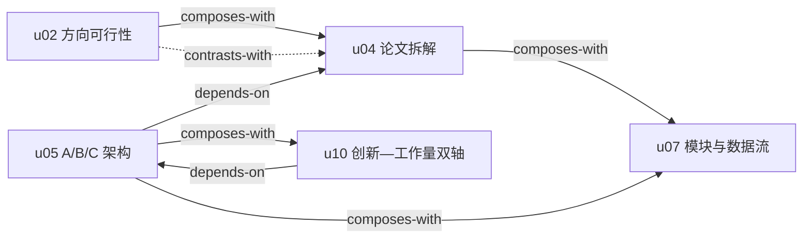

# 《学术裁缝课程》补充 RIA++ Skills

> 本目录是 `academic-stitcher-skill` 的独立补充包，共 5 个窄域 skills；它们不覆盖仓库根目录的通用基座。

## 共享材料

- [精华说明](./DIGEST.md)
- [共享术语词典](./GLOSSARY.md)

## Skill 列表

### 方向与入口

- [direction-feasibility-foundation-map](./direction-feasibility-foundation-map/SKILL.md)：用文献密度、综述覆盖、组内传承和资源硬门判断方向能否落地。

### 论文证据与研究架构

- [purpose-driven-paper-decomposition](./purpose-driven-paper-decomposition/SKILL.md)：按阅读目的提取可追溯的基准、模块、接口与证据。
- [variable-granularity-abc-research-architecture](./variable-granularity-abc-research-architecture/SKILL.md)：区分 A/B/C 的继承、改动、新增和历史归属。

### 模块迁移与数据流

- [three-domain-module-search-dataflow-adaptation](./three-domain-module-search-dataflow-adaptation/SKILL.md)：沿真实输入—输出数据流完成 B′/C′ 适配与单模块验证。

### 贡献与论文交付

- [innovation-workload-dual-axis](./innovation-workload-dual-axis/SKILL.md)：将创新证据与可核查工作量分轴映射到模块、实验和章节。

## 推荐使用顺序

1. 仍在选方向或担心基础断裂：先用 `direction-feasibility-foundation-map`。
2. 已有明确论文对象：用 `purpose-driven-paper-decomposition` 固定阅读目的和证据。
3. 依据论文证据确定 A/B/C 边界：用 `variable-granularity-abc-research-architecture`。
4. 基线和粒度明确后寻找模块：用 `three-domain-module-search-dataflow-adaptation`。
5. 规划小论文/学位论文交付：用 `innovation-workload-dual-axis`。

## 引用关系

## 边界

这些 skill 是带证据状态的方法框架，不是学校政策、发表保证或独立复现实验。ASR、AI 字幕、PDF 导出/OCR、讲者自述和课程案例不能直接升级为当前规则或普遍事实。原始材料和内部阶段审计不随 GitHub 发布包提供。

每个 skill 目录中的 `test-prompts.json` 和 `test-results.md` 保留 Darwin/Cangjie 兼容的触发边界与验证结果。
